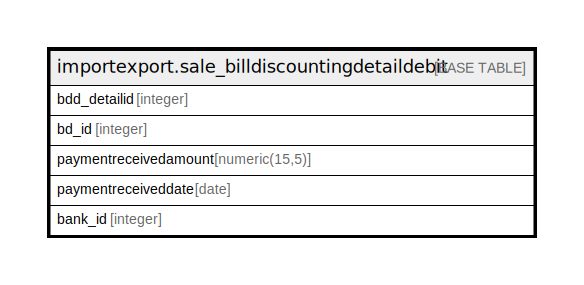

# importexport.sale_billdiscountingdetaildebit

## Description

## Columns

| Name | Type | Default | Nullable | Children | Parents | Comment |
| ---- | ---- | ------- | -------- | -------- | ------- | ------- |
| bdd_detailid | integer | nextval('importexport.sale_billdiscountingdetaildebit_bdd_detailid_seq'::regclass) | false |  |  |  |
| bd_id | integer |  | false |  |  |  |
| paymentreceivedamount | numeric(15,5) |  | true |  |  |  |
| paymentreceiveddate | date |  | true |  |  |  |
| bank_id | integer |  | true |  |  |  |

## Constraints

| Name | Type | Definition |
| ---- | ---- | ---------- |
| sale_billdiscountingdetaildebit_pkey | PRIMARY KEY | PRIMARY KEY (bdd_detailid) |

## Indexes

| Name | Definition |
| ---- | ---------- |
| sale_billdiscountingdetaildebit_pkey | CREATE UNIQUE INDEX sale_billdiscountingdetaildebit_pkey ON importexport.sale_billdiscountingdetaildebit USING btree (bdd_detailid) |

## Relations

---

> Generated by [tbls](https://github.com/k1LoW/tbls)
