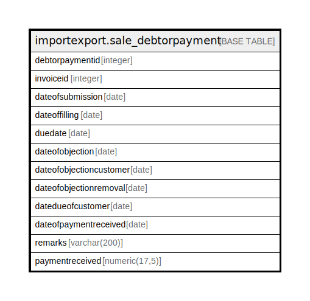

# importexport.sale_debtorpayment

## Description

## Columns

| Name | Type | Default | Nullable | Children | Parents | Comment |
| ---- | ---- | ------- | -------- | -------- | ------- | ------- |
| debtorpaymentid | integer | nextval('importexport.sale_debtorpayment_debtorpaymentid_seq'::regclass) | false |  |  |  |
| invoiceid | integer |  | false |  |  |  |
| dateofsubmission | date |  | true |  |  |  |
| dateoffilling | date |  | true |  |  |  |
| duedate | date |  | true |  |  |  |
| dateofobjection | date |  | true |  |  |  |
| dateofobjectioncustomer | date |  | true |  |  |  |
| dateofobjectionremoval | date |  | true |  |  |  |
| datedueofcustomer | date |  | true |  |  |  |
| dateofpaymentreceived | date |  | true |  |  |  |
| remarks | varchar(200) |  | true |  |  |  |
| paymentreceived | numeric(17,5) |  | true |  |  |  |

## Constraints

| Name | Type | Definition |
| ---- | ---- | ---------- |
| sale_debtorpayment_pkey | PRIMARY KEY | PRIMARY KEY (debtorpaymentid) |

## Indexes

| Name | Definition |
| ---- | ---------- |
| sale_debtorpayment_pkey | CREATE UNIQUE INDEX sale_debtorpayment_pkey ON importexport.sale_debtorpayment USING btree (debtorpaymentid) |

## Relations

---

> Generated by [tbls](https://github.com/k1LoW/tbls)
