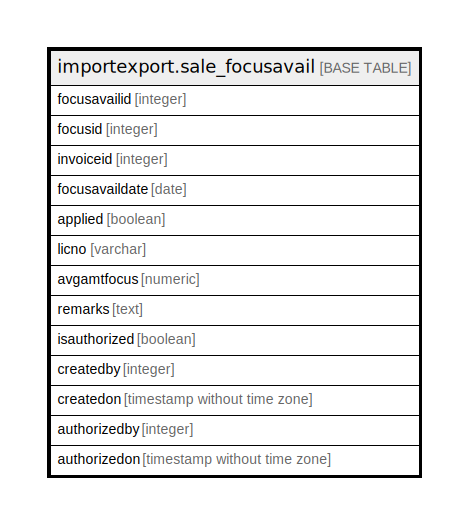

# importexport.sale_focusavail

## Description

## Columns

| Name | Type | Default | Nullable | Children | Parents | Comment |
| ---- | ---- | ------- | -------- | -------- | ------- | ------- |
| focusavailid | integer | nextval('importexport.sale_focusavail_focusavailid_seq'::regclass) | false |  |  |  |
| focusid | integer |  | true |  |  |  |
| invoiceid | integer |  | true |  |  |  |
| focusavaildate | date |  | true |  |  |  |
| applied | boolean | false | true |  |  |  |
| licno | varchar |  | true |  |  |  |
| avgamtfocus | numeric |  | true |  |  |  |
| remarks | text |  | true |  |  |  |
| isauthorized | boolean |  | true |  |  |  |
| createdby | integer |  | true |  |  |  |
| createdon | timestamp without time zone |  | true |  |  |  |
| authorizedby | integer |  | true |  |  |  |
| authorizedon | timestamp without time zone |  | true |  |  |  |

## Constraints

| Name | Type | Definition |
| ---- | ---- | ---------- |
| sale_focusavail_pkey | PRIMARY KEY | PRIMARY KEY (focusavailid) |

## Indexes

| Name | Definition |
| ---- | ---------- |
| sale_focusavail_pkey | CREATE UNIQUE INDEX sale_focusavail_pkey ON importexport.sale_focusavail USING btree (focusavailid) |

## Relations

---

> Generated by [tbls](https://github.com/k1LoW/tbls)
