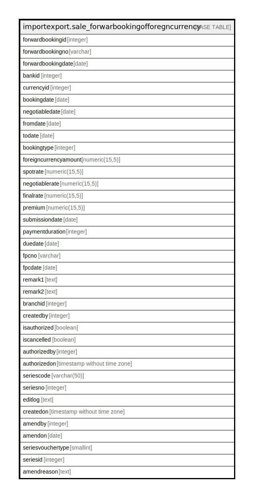

# importexport.sale_forwarbookingofforegncurrency

## Description

## Columns

| Name | Type | Default | Nullable | Children | Parents | Comment |
| ---- | ---- | ------- | -------- | -------- | ------- | ------- |
| forwardbookingid | integer | nextval('importexport.sale_forwarbookingofforegncurrency_forwardbookingid_seq'::regclass) | false |  |  |  |
| forwardbookingno | varchar |  | true |  |  |  |
| forwardbookingdate | date |  | true |  |  |  |
| bankid | integer |  | true |  |  |  |
| currencyid | integer |  | true |  |  |  |
| bookingdate | date |  | true |  |  |  |
| negotiabledate | date |  | true |  |  |  |
| fromdate | date |  | true |  |  |  |
| todate | date |  | true |  |  |  |
| bookingtype | integer |  | true |  |  |  |
| foreigncurrencyamount | numeric(15,5) |  | true |  |  |  |
| spotrate | numeric(15,5) |  | true |  |  |  |
| negotiablerate | numeric(15,5) |  | true |  |  |  |
| finalrate | numeric(15,5) |  | true |  |  |  |
| premium | numeric(15,5) |  | true |  |  |  |
| submissiondate | date |  | true |  |  |  |
| paymentduration | integer |  | true |  |  |  |
| duedate | date |  | true |  |  |  |
| fpcno | varchar |  | true |  |  |  |
| fpcdate | date |  | true |  |  |  |
| remark1 | text |  | true |  |  |  |
| remark2 | text |  | true |  |  |  |
| branchid | integer |  | true |  |  |  |
| createdby | integer |  | false |  |  |  |
| isauthorized | boolean | false | false |  |  |  |
| iscancelled | boolean | false | false |  |  |  |
| authorizedby | integer |  | true |  |  |  |
| authorizedon | timestamp without time zone |  | true |  |  |  |
| seriescode | varchar(50) |  | true |  |  |  |
| seriesno | integer |  | true |  |  |  |
| editlog | text |  | true |  |  |  |
| createdon | timestamp without time zone | now() | true |  |  |  |
| amendby | integer |  | true |  |  |  |
| amendon | date |  | true |  |  |  |
| seriesvouchertype | smallint | 0 | true |  |  |  |
| seriesid | integer |  | true |  |  |  |
| amendreason | text |  | true |  |  |  |

## Constraints

| Name | Type | Definition |
| ---- | ---- | ---------- |
| sale_forwarbookingofforegncurrency_pkey | PRIMARY KEY | PRIMARY KEY (forwardbookingid) |

## Indexes

| Name | Definition |
| ---- | ---------- |
| sale_forwarbookingofforegncurrency_pkey | CREATE UNIQUE INDEX sale_forwarbookingofforegncurrency_pkey ON importexport.sale_forwarbookingofforegncurrency USING btree (forwardbookingid) |

## Triggers

| Name | Definition |
| ---- | ---------- |
| forwardbooking_amend_log_entry | CREATE TRIGGER forwardbooking_amend_log_entry BEFORE UPDATE ON importexport.sale_forwarbookingofforegncurrency FOR EACH ROW EXECUTE FUNCTION importexport.forwardbooking_amend_log_entry() |

## Relations

---

> Generated by [tbls](https://github.com/k1LoW/tbls)
