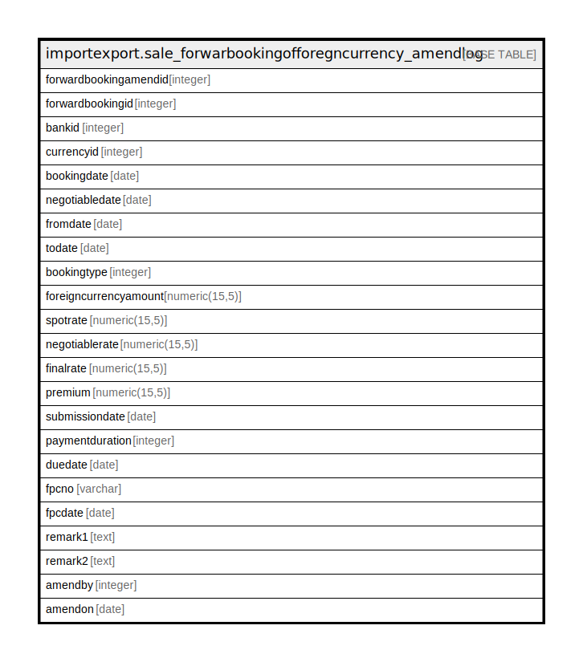

# importexport.sale_forwarbookingofforegncurrency_amendlog

## Description

## Columns

| Name | Type | Default | Nullable | Children | Parents | Comment |
| ---- | ---- | ------- | -------- | -------- | ------- | ------- |
| forwardbookingamendid | integer | nextval('importexport.sale_forwarbookingofforegncurrency_am_forwardbookingamendid_seq'::regclass) | false |  |  |  |
| forwardbookingid | integer | nextval('importexport.sale_forwarbookingofforegncurrency_amendlo_forwardbookingid_seq'::regclass) | false |  |  |  |
| bankid | integer |  | true |  |  |  |
| currencyid | integer |  | true |  |  |  |
| bookingdate | date |  | true |  |  |  |
| negotiabledate | date |  | true |  |  |  |
| fromdate | date |  | true |  |  |  |
| todate | date |  | true |  |  |  |
| bookingtype | integer |  | true |  |  |  |
| foreigncurrencyamount | numeric(15,5) |  | true |  |  |  |
| spotrate | numeric(15,5) |  | true |  |  |  |
| negotiablerate | numeric(15,5) |  | true |  |  |  |
| finalrate | numeric(15,5) |  | true |  |  |  |
| premium | numeric(15,5) |  | true |  |  |  |
| submissiondate | date |  | true |  |  |  |
| paymentduration | integer |  | true |  |  |  |
| duedate | date |  | true |  |  |  |
| fpcno | varchar |  | true |  |  |  |
| fpcdate | date |  | true |  |  |  |
| remark1 | text |  | true |  |  |  |
| remark2 | text |  | true |  |  |  |
| amendby | integer |  | true |  |  |  |
| amendon | date |  | true |  |  |  |

## Constraints

| Name | Type | Definition |
| ---- | ---- | ---------- |
| sale_forwarbookingofforegncurrency_amendlog_pkey | PRIMARY KEY | PRIMARY KEY (forwardbookingamendid) |

## Indexes

| Name | Definition |
| ---- | ---------- |
| sale_forwarbookingofforegncurrency_amendlog_pkey | CREATE UNIQUE INDEX sale_forwarbookingofforegncurrency_amendlog_pkey ON importexport.sale_forwarbookingofforegncurrency_amendlog USING btree (forwardbookingamendid) |

## Relations

---

> Generated by [tbls](https://github.com/k1LoW/tbls)
