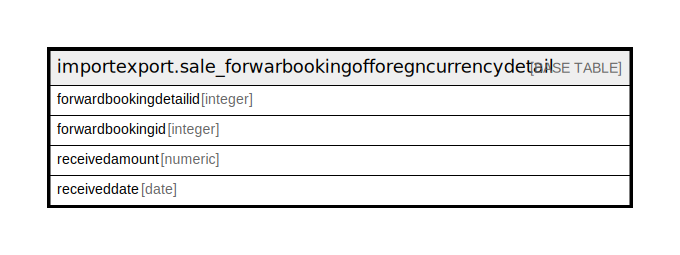

# importexport.sale_forwarbookingofforegncurrencydetail

## Description

## Columns

| Name | Type | Default | Nullable | Children | Parents | Comment |
| ---- | ---- | ------- | -------- | -------- | ------- | ------- |
| forwardbookingdetailid | integer | nextval('importexport.sale_forwarbookingofforegncurrencyde_forwardbookingdetailid_seq'::regclass) | false |  |  |  |
| forwardbookingid | integer |  | true |  |  |  |
| receivedamount | numeric |  | true |  |  |  |
| receiveddate | date |  | true |  |  |  |

## Constraints

| Name | Type | Definition |
| ---- | ---- | ---------- |
| sale_forwarbookingofforegncurrencydetail_pkey | PRIMARY KEY | PRIMARY KEY (forwardbookingdetailid) |

## Indexes

| Name | Definition |
| ---- | ---------- |
| sale_forwarbookingofforegncurrencydetail_pkey | CREATE UNIQUE INDEX sale_forwarbookingofforegncurrencydetail_pkey ON importexport.sale_forwarbookingofforegncurrencydetail USING btree (forwardbookingdetailid) |

## Relations

---

> Generated by [tbls](https://github.com/k1LoW/tbls)
