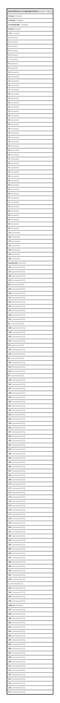

# kamdhenu.tmpsipretax

## Description

## Columns

| Name | Type | Default | Nullable | Children | Parents | Comment |
| ---- | ---- | ------- | -------- | -------- | ------- | ------- |
| invtype | integer |  | true |  |  |  |
| invoiceid | integer |  | true |  |  |  |
| invoicedetailid | integer |  | true |  |  |  |
| itemid | integer |  | true |  |  |  |
| -15 | numeric |  | true |  |  |  |
| 2 | numeric |  | true |  |  |  |
| 3 | numeric |  | true |  |  |  |
| 4 | numeric |  | true |  |  |  |
| 5 | numeric |  | true |  |  |  |
| 6 | numeric |  | true |  |  |  |
| 7 | numeric |  | true |  |  |  |
| 8 | numeric |  | true |  |  |  |
| 9 | numeric |  | true |  |  |  |
| 10 | numeric |  | true |  |  |  |
| 11 | numeric |  | true |  |  |  |
| 12 | numeric |  | true |  |  |  |
| 16 | numeric |  | true |  |  |  |
| 17 | numeric |  | true |  |  |  |
| 18 | numeric |  | true |  |  |  |
| 19 | numeric |  | true |  |  |  |
| 20 | numeric |  | true |  |  |  |
| 22 | numeric |  | true |  |  |  |
| 23 | numeric |  | true |  |  |  |
| 26 | numeric |  | true |  |  |  |
| 28 | numeric |  | true |  |  |  |
| 29 | numeric |  | true |  |  |  |
| 30 | numeric |  | true |  |  |  |
| 31 | numeric |  | true |  |  |  |
| 32 | numeric |  | true |  |  |  |
| 33 | numeric |  | true |  |  |  |
| 34 | numeric |  | true |  |  |  |
| 35 | numeric |  | true |  |  |  |
| 36 | numeric |  | true |  |  |  |
| 37 | numeric |  | true |  |  |  |
| 38 | numeric |  | true |  |  |  |
| 41 | numeric |  | true |  |  |  |
| 44 | numeric |  | true |  |  |  |
| 45 | numeric |  | true |  |  |  |
| 46 | numeric |  | true |  |  |  |
| 48 | numeric |  | true |  |  |  |
| 49 | numeric |  | true |  |  |  |
| 50 | numeric |  | true |  |  |  |
| 75 | numeric |  | true |  |  |  |
| 77 | numeric |  | true |  |  |  |
| 78 | numeric |  | true |  |  |  |
| 80 | numeric |  | true |  |  |  |
| 83 | numeric |  | true |  |  |  |
| 84 | numeric |  | true |  |  |  |
| 92 | numeric |  | true |  |  |  |
| 94 | numeric |  | true |  |  |  |
| 114 | numeric |  | true |  |  |  |
| 115 | numeric |  | true |  |  |  |
| 120 | numeric |  | true |  |  |  |
| 121 | numeric |  | true |  |  |  |
| 123 | numeric |  | true |  |  |  |
| 124 | numeric |  | true |  |  |  |
| 125 | numeric |  | true |  |  |  |
| pretaxtotal | numeric |  | true |  |  |  |
| 126 | numeric(18,2) | 0 | true |  |  |  |
| 127 | numeric(18,2) | 0 | true |  |  |  |
| 128 | numeric(18,2) | 0 | true |  |  |  |
| 129 | numeric(18,2) | 0 | true |  |  |  |
| 99 | numeric(18,2) | 0 | true |  |  |  |
| 104 | numeric(18,2) | 0 | true |  |  |  |
| 130 | numeric(18,2) | 0 | true |  |  |  |
| 131 | numeric(18,2) | 0 | true |  |  |  |
| 132 | numeric(18,2) | 0 | true |  |  |  |
| 133 | numeric(18,2) | 0 | true |  |  |  |
| 134 | numeric(18,2) | 0 | true |  |  |  |
| 136 | numeric(18,2) | 0 | true |  |  |  |
| 137 | numeric(18,2) | 0 | true |  |  |  |
| 61 | numeric(18,2) | 0 | true |  |  |  |
| 138 | numeric(18,2) | 0 | true |  |  |  |
| 139 | numeric(18,2) | 0 | true |  |  |  |
| 140 | numeric(18,2) | 0 | true |  |  |  |
| 141 | numeric(18,2) | 0 | true |  |  |  |
| 93 | numeric(18,2) | 0 | true |  |  |  |
| 142 | numeric(18,2) | 0 | true |  |  |  |
| 118 | numeric(18,2) | 0 | true |  |  |  |
| 91 | numeric(18,2) | 0 | true |  |  |  |
| 143 | numeric(18,2) | 0 | true |  |  |  |
| 144 | numeric(18,2) | 0 | true |  |  |  |
| 100 | numeric(18,2) | 0 | true |  |  |  |
| 87 | numeric(18,2) | 0 | true |  |  |  |
| 145 | numeric(18,2) | 0 | true |  |  |  |
| 146 | numeric(18,2) | 0 | true |  |  |  |
| 147 | numeric(18,2) | 0 | true |  |  |  |
| 148 | numeric(18,2) | 0 | true |  |  |  |
| 149 | numeric(18,2) | 0 | true |  |  |  |
| 150 | numeric(18,2) | 0 | true |  |  |  |
| 151 | numeric(18,2) | 0 | true |  |  |  |
| 152 | numeric(18,2) | 0 | true |  |  |  |
| 153 | numeric(18,2) | 0 | true |  |  |  |
| 154 | numeric(18,2) | 0 | true |  |  |  |
| 155 | numeric(18,2) | 0 | true |  |  |  |
| 156 | numeric(18,2) | 0 | true |  |  |  |
| 157 | numeric(18,2) | 0 | true |  |  |  |
| 159 | numeric(18,2) | 0 | true |  |  |  |
| 160 | numeric(18,2) | 0 | true |  |  |  |
| 161 | numeric(18,2) | 0 | true |  |  |  |
| 162 | numeric(18,2) | 0 | true |  |  |  |
| 163 | numeric(18,2) | 0 | true |  |  |  |
| 164 | numeric(18,2) | 0 | true |  |  |  |
| 165 | numeric(18,2) | 0 | true |  |  |  |
| 166 | numeric(18,2) | 0 | true |  |  |  |
| 167 | numeric(18,2) | 0 | true |  |  |  |
| 168 | numeric(18,2) | 0 | true |  |  |  |
| 169 | numeric(18,2) | 0 | true |  |  |  |
| 170 | numeric(18,2) | 0 | true |  |  |  |
| 171 | numeric(18,2) | 0 | true |  |  |  |
| 172 | numeric(18,2) | 0 | true |  |  |  |
| 173 | numeric(18,2) | 0 | true |  |  |  |
| 174 | numeric(18,2) | 0 | true |  |  |  |
| 175 | numeric(18,2) | 0 | true |  |  |  |
| 176 | numeric(18,2) | 0 | true |  |  |  |
| 177 | numeric(18,2) | 0 | true |  |  |  |
| 178 | numeric(18,2) | 0 | true |  |  |  |
| 179 | numeric(18,2) | 0 | true |  |  |  |
| 180 | numeric(18,2) | 0 | true |  |  |  |
| 181 | numeric(18,2) | 0 | true |  |  |  |
| 182 | numeric(18,2) | 0 | true |  |  |  |
| 183 | numeric(18,2) | 0 | true |  |  |  |
| 184 | numeric(18,2) | 0 | true |  |  |  |
| 185 | numeric(18,2) | 0 | true |  |  |  |
| 186 | numeric(18,2) | 0 | true |  |  |  |
| 187 | numeric(18,2) | 0 | true |  |  |  |
| 188 | numeric(18,2) | 0 | true |  |  |  |
| 189 | numeric(18,2) | 0 | true |  |  |  |
| 190 | numeric(18,2) | 0 | true |  |  |  |
| 191 | numeric(18,2) | 0 | true |  |  |  |
| 192 | numeric(18,2) | 0 | true |  |  |  |
| 1 | numeric(18,2) | 0 | true |  |  |  |
| 193 | numeric(18,2) | 0 | true |  |  |  |
| 194 | numeric(18,2) | 0 | true |  |  |  |
| 195 | numeric(18,2) | 0 | true |  |  |  |
| 196 | numeric(18,2) | 0 | true |  |  |  |
| table_id | integer | nextval('kamdhenu.tmpsipretax_table_id_seq'::regclass) | false |  |  |  |
| 197 | numeric(18,2) | 0 | true |  |  |  |
| 198 | numeric(18,2) | 0 | true |  |  |  |
| 199 | numeric(18,2) | 0 | true |  |  |  |
| 200 | numeric(18,2) | 0 | true |  |  |  |
| 201 | numeric(18,2) | 0 | true |  |  |  |
| 202 | numeric(18,2) | 0 | true |  |  |  |
| 203 | numeric(18,2) | 0 | true |  |  |  |
| 204 | numeric(18,2) | 0 | true |  |  |  |
| 205 | numeric(18,2) | 0 | true |  |  |  |
| 206 | numeric(18,2) | 0 | true |  |  |  |
| 207 | numeric(18,2) | 0 | true |  |  |  |
| 208 | numeric(18,2) | 0 | true |  |  |  |
| 209 | numeric(18,2) | 0 | true |  |  |  |
| 211 | numeric(18,2) | 0 | true |  |  |  |
| 212 | numeric(18,2) | 0 | true |  |  |  |
| 213 | numeric(18,2) | 0 | true |  |  |  |
| 214 | numeric(18,2) | 0 | true |  |  |  |
| 215 | numeric(18,2) | 0 | true |  |  |  |
| 216 | numeric(18,2) | 0 | true |  |  |  |
| 217 | numeric(18,2) | 0 | true |  |  |  |

## Relations

---

> Generated by [tbls](https://github.com/k1LoW/tbls)
