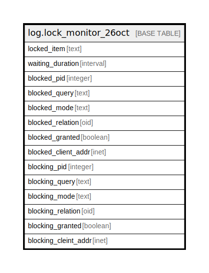

# log.lock_monitor_26oct

## Description

## Columns

| Name | Type | Default | Nullable | Children | Parents | Comment |
| ---- | ---- | ------- | -------- | -------- | ------- | ------- |
| locked_item | text |  | true |  |  |  |
| waiting_duration | interval |  | true |  |  |  |
| blocked_pid | integer |  | true |  |  |  |
| blocked_query | text |  | true |  |  |  |
| blocked_mode | text |  | true |  |  |  |
| blocked_relation | oid |  | true |  |  |  |
| blocked_granted | boolean |  | true |  |  |  |
| blocked_client_addr | inet |  | true |  |  |  |
| blocking_pid | integer |  | true |  |  |  |
| blocking_query | text |  | true |  |  |  |
| blocking_mode | text |  | true |  |  |  |
| blocking_relation | oid |  | true |  |  |  |
| blocking_granted | boolean |  | true |  |  |  |
| blocking_cleint_addr | inet |  | true |  |  |  |

## Relations

---

> Generated by [tbls](https://github.com/k1LoW/tbls)
