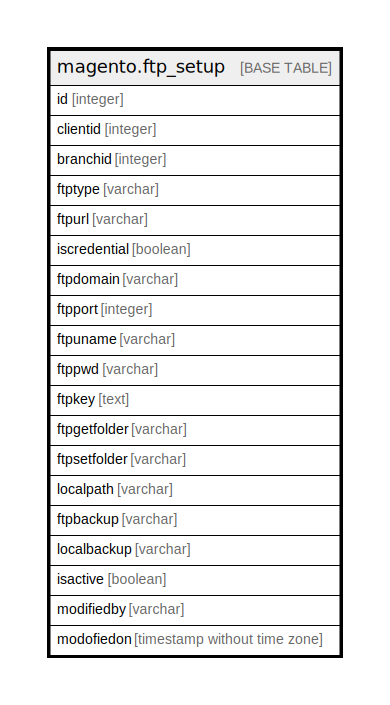

# magento.ftp_setup

## Description

This table is used for keep all FTP configuration

## Columns

| Name | Type | Default | Nullable | Children | Parents | Comment |
| ---- | ---- | ------- | -------- | -------- | ------- | ------- |
| id | integer | nextval('seq_ftp_setup_id'::regclass) | false |  |  |  |
| clientid | integer |  | false |  |  |  |
| branchid | integer |  | false |  |  |  |
| ftptype | varchar |  | false |  |  |  |
| ftpurl | varchar |  | false |  |  |  |
| iscredential | boolean | false | false |  |  |  |
| ftpdomain | varchar |  | true |  |  |  |
| ftpport | integer |  | true |  |  |  |
| ftpuname | varchar |  | true |  |  |  |
| ftppwd | varchar |  | true |  |  |  |
| ftpkey | text |  | true |  |  |  |
| ftpgetfolder | varchar |  | true |  |  |  |
| ftpsetfolder | varchar |  | true |  |  |  |
| localpath | varchar |  | true |  |  |  |
| ftpbackup | varchar |  | true |  |  |  |
| localbackup | varchar |  | true |  |  |  |
| isactive | boolean | true | false |  |  |  |
| modifiedby | varchar |  | true |  |  |  |
| modofiedon | timestamp without time zone | now() | true |  |  |  |

## Constraints

| Name | Type | Definition |
| ---- | ---- | ---------- |
| ftp_setup_clientid_branchid_isactive_key | UNIQUE | UNIQUE (clientid, branchid, isactive) |
| ftp_setup_pkey | PRIMARY KEY | PRIMARY KEY (id) |

## Indexes

| Name | Definition |
| ---- | ---------- |
| ftp_setup_clientid_branchid_isactive_key | CREATE UNIQUE INDEX ftp_setup_clientid_branchid_isactive_key ON magento.ftp_setup USING btree (clientid, branchid, isactive) |
| ftp_setup_pkey | CREATE UNIQUE INDEX ftp_setup_pkey ON magento.ftp_setup USING btree (id) |

## Relations

---

> Generated by [tbls](https://github.com/k1LoW/tbls)
