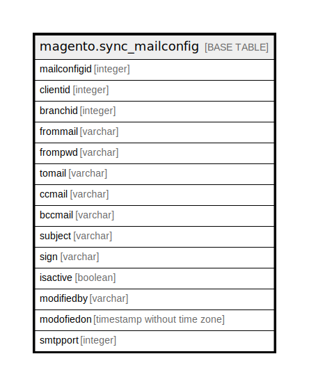

# magento.sync_mailconfig

## Description

## Columns

| Name | Type | Default | Nullable | Children | Parents | Comment |
| ---- | ---- | ------- | -------- | -------- | ------- | ------- |
| mailconfigid | integer | nextval('seq_sync_mailconfig_id'::regclass) | false |  |  |  |
| clientid | integer |  | false |  |  |  |
| branchid | integer |  | false |  |  |  |
| frommail | varchar |  | false |  |  |  |
| frompwd | varchar |  | false |  |  |  |
| tomail | varchar |  | false |  |  |  |
| ccmail | varchar |  | true |  |  |  |
| bccmail | varchar |  | true |  |  |  |
| subject | varchar |  | false |  |  |  |
| sign | varchar |  | false |  |  |  |
| isactive | boolean | true | false |  |  |  |
| modifiedby | varchar |  | true |  |  |  |
| modofiedon | timestamp without time zone | now() | true |  |  |  |
| smtpport | integer | 25 | false |  |  |  |

## Constraints

| Name | Type | Definition |
| ---- | ---- | ---------- |
| sync_mailconfig_pkey | PRIMARY KEY | PRIMARY KEY (mailconfigid) |

## Indexes

| Name | Definition |
| ---- | ---------- |
| sync_mailconfig_pkey | CREATE UNIQUE INDEX sync_mailconfig_pkey ON magento.sync_mailconfig USING btree (mailconfigid) |

## Relations

---

> Generated by [tbls](https://github.com/k1LoW/tbls)
