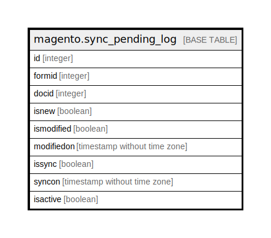

# magento.sync_pending_log

## Description

This table is used for keep all pending records to sync

## Columns

| Name | Type | Default | Nullable | Children | Parents | Comment |
| ---- | ---- | ------- | -------- | -------- | ------- | ------- |
| id | integer | nextval('seq_sync_pending_log_id'::regclass) | false |  |  |  |
| formid | integer | 0 | false |  |  |  |
| docid | integer | 0 | false |  |  |  |
| isnew | boolean | false | false |  |  |  |
| ismodified | boolean | false | false |  |  |  |
| modifiedon | timestamp without time zone |  | true |  |  |  |
| issync | boolean | false | false |  |  |  |
| syncon | timestamp without time zone |  | true |  |  |  |
| isactive | boolean | false | false |  |  |  |

## Constraints

| Name | Type | Definition |
| ---- | ---- | ---------- |
| sync_pending_log_pkey | PRIMARY KEY | PRIMARY KEY (id) |

## Indexes

| Name | Definition |
| ---- | ---------- |
| sync_pending_log_pkey | CREATE UNIQUE INDEX sync_pending_log_pkey ON magento.sync_pending_log USING btree (id) |

## Relations

---

> Generated by [tbls](https://github.com/k1LoW/tbls)
