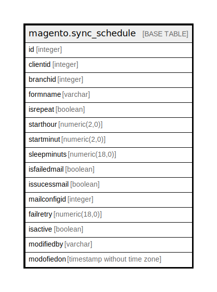

# magento.sync_schedule

## Description

This table is used for keep all Sync configuration

## Columns

| Name | Type | Default | Nullable | Children | Parents | Comment |
| ---- | ---- | ------- | -------- | -------- | ------- | ------- |
| id | integer | nextval('seq_sync_schedule_id'::regclass) | false |  |  |  |
| clientid | integer |  | false |  |  |  |
| branchid | integer |  | false |  |  |  |
| formname | varchar |  | false |  |  |  |
| isrepeat | boolean | true | true |  |  |  |
| starthour | numeric(2,0) | 0 | true |  |  |  |
| startminut | numeric(2,0) | 0 | true |  |  |  |
| sleepminuts | numeric(18,0) | 0 | true |  |  |  |
| isfailedmail | boolean | false | false |  |  |  |
| issucessmail | boolean | false | false |  |  |  |
| mailconfigid | integer |  | true |  |  |  |
| failretry | numeric(18,0) | 0 | true |  |  |  |
| isactive | boolean | true | false |  |  |  |
| modifiedby | varchar |  | true |  |  |  |
| modofiedon | timestamp without time zone | now() | true |  |  |  |

## Constraints

| Name | Type | Definition |
| ---- | ---- | ---------- |
| sync_schedule_clientid_branchid_formname_isactive_key | UNIQUE | UNIQUE (clientid, branchid, formname, isactive) |
| sync_schedule_pkey | PRIMARY KEY | PRIMARY KEY (id) |

## Indexes

| Name | Definition |
| ---- | ---------- |
| sync_schedule_clientid_branchid_formname_isactive_key | CREATE UNIQUE INDEX sync_schedule_clientid_branchid_formname_isactive_key ON magento.sync_schedule USING btree (clientid, branchid, formname, isactive) |
| sync_schedule_pkey | CREATE UNIQUE INDEX sync_schedule_pkey ON magento.sync_schedule USING btree (id) |

## Relations

---

> Generated by [tbls](https://github.com/k1LoW/tbls)
