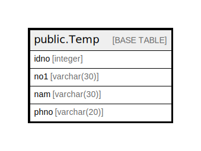

# public.Temp

## Description

## Columns

| Name | Type | Default | Nullable | Children | Parents | Comment |
| ---- | ---- | ------- | -------- | -------- | ------- | ------- |
| idno | integer | nextval('"Temp_idno_seq"'::regclass) | false |  |  |  |
| no1 | varchar(30) |  | true |  |  |  |
| nam | varchar(30) |  | true |  |  |  |
| phno | varchar(20) |  | true |  |  |  |

## Constraints

| Name | Type | Definition |
| ---- | ---- | ---------- |
| Temp_pkey | PRIMARY KEY | PRIMARY KEY (idno) |

## Indexes

| Name | Definition |
| ---- | ---------- |
| Temp_pkey | CREATE UNIQUE INDEX "Temp_pkey" ON public."Temp" USING btree (idno) |

## Relations

---

> Generated by [tbls](https://github.com/k1LoW/tbls)
