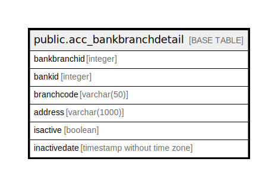

# public.acc_bankbranchdetail

## Description

## Columns

| Name | Type | Default | Nullable | Children | Parents | Comment |
| ---- | ---- | ------- | -------- | -------- | ------- | ------- |
| bankbranchid | integer | nextval('acc_bankbranchdetail_bankbranchid_seq'::regclass) | false |  |  |  |
| bankid | integer |  | false |  |  |  |
| branchcode | varchar(50) |  | true |  |  |  |
| address | varchar(1000) |  | true |  |  |  |
| isactive | boolean | true | true |  |  |  |
| inactivedate | timestamp without time zone |  | true |  |  |  |

## Constraints

| Name | Type | Definition |
| ---- | ---- | ---------- |
| acc_bankbranchdetail_pkey | PRIMARY KEY | PRIMARY KEY (bankbranchid) |

## Indexes

| Name | Definition |
| ---- | ---------- |
| acc_bankbranchdetail_pkey | CREATE UNIQUE INDEX acc_bankbranchdetail_pkey ON public.acc_bankbranchdetail USING btree (bankbranchid) |

## Relations

---

> Generated by [tbls](https://github.com/k1LoW/tbls)
