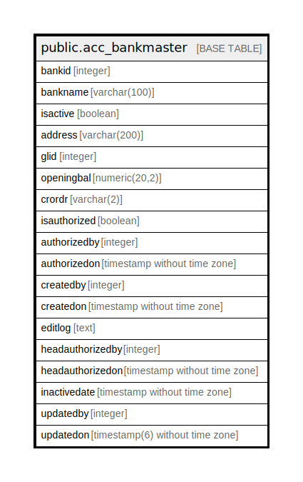

# public.acc_bankmaster

## Description

## Columns

| Name | Type | Default | Nullable | Children | Parents | Comment |
| ---- | ---- | ------- | -------- | -------- | ------- | ------- |
| bankid | integer | nextval('acc_bankmaster_bankid_seq'::regclass) | false |  |  |  |
| bankname | varchar(100) |  | true |  |  |  |
| isactive | boolean | true | false |  |  |  |
| address | varchar(200) |  | true |  |  |  |
| glid | integer |  | true |  |  |  |
| openingbal | numeric(20,2) |  | true |  |  |  |
| crordr | varchar(2) |  | true |  |  |  |
| isauthorized | boolean | false | false |  |  |  |
| authorizedby | integer |  | true |  |  |  |
| authorizedon | timestamp without time zone |  | true |  |  |  |
| createdby | integer |  | true |  |  |  |
| createdon | timestamp without time zone | now() | true |  |  |  |
| editlog | text |  | true |  |  |  |
| headauthorizedby | integer |  | true |  |  |  |
| headauthorizedon | timestamp without time zone |  | true |  |  |  |
| inactivedate | timestamp without time zone |  | true |  |  |  |
| updatedby | integer |  | true |  |  |  |
| updatedon | timestamp(6) without time zone | NULL::timestamp without time zone | true |  |  |  |

## Constraints

| Name | Type | Definition |
| ---- | ---- | ---------- |
| Bank Name | UNIQUE | UNIQUE (bankname) |
| bankmaster_pkey | PRIMARY KEY | PRIMARY KEY (bankid) |

## Indexes

| Name | Definition |
| ---- | ---------- |
| Bank Name | CREATE UNIQUE INDEX "Bank Name" ON public.acc_bankmaster USING btree (bankname) |
| bankmaster_pkey | CREATE UNIQUE INDEX bankmaster_pkey ON public.acc_bankmaster USING btree (bankid) |

## Relations

---

> Generated by [tbls](https://github.com/k1LoW/tbls)
