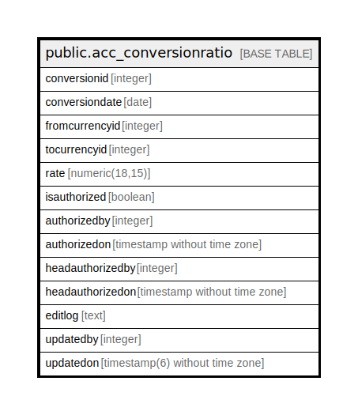

# public.acc_conversionratio

## Description

## Columns

| Name | Type | Default | Nullable | Children | Parents | Comment |
| ---- | ---- | ------- | -------- | -------- | ------- | ------- |
| conversionid | integer | nextval('acc_conversionratio_conversionid_seq'::regclass) | false |  |  |  |
| conversiondate | date |  | false |  |  |  |
| fromcurrencyid | integer |  | false |  |  |  |
| tocurrencyid | integer |  | false |  |  |  |
| rate | numeric(18,15) |  | true |  |  |  |
| isauthorized | boolean | false | false |  |  |  |
| authorizedby | integer |  | true |  |  |  |
| authorizedon | timestamp without time zone |  | true |  |  |  |
| headauthorizedby | integer |  | true |  |  |  |
| headauthorizedon | timestamp without time zone |  | true |  |  |  |
| editlog | text |  | true |  |  |  |
| updatedby | integer |  | true |  |  |  |
| updatedon | timestamp(6) without time zone | NULL::timestamp without time zone | true |  |  |  |

## Constraints

| Name | Type | Definition |
| ---- | ---- | ---------- |
| conversionratio_conversiondate_key | UNIQUE | UNIQUE (conversiondate, fromcurrencyid, tocurrencyid) |
| conversionration_pkey | PRIMARY KEY | PRIMARY KEY (conversionid) |

## Indexes

| Name | Definition |
| ---- | ---------- |
| conversionratio_conversiondate_key | CREATE UNIQUE INDEX conversionratio_conversiondate_key ON public.acc_conversionratio USING btree (conversiondate, fromcurrencyid, tocurrencyid) |
| conversionration_pkey | CREATE UNIQUE INDEX conversionration_pkey ON public.acc_conversionratio USING btree (conversionid) |

## Relations

---

> Generated by [tbls](https://github.com/k1LoW/tbls)
