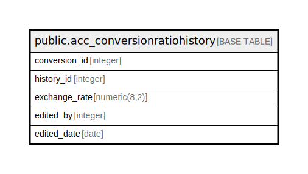

# public.acc_conversionratiohistory

## Description

## Columns

| Name | Type | Default | Nullable | Children | Parents | Comment |
| ---- | ---- | ------- | -------- | -------- | ------- | ------- |
| conversion_id | integer |  | true |  |  |  |
| history_id | integer | nextval('acc_conversionratiohistory_history_id_seq'::regclass) | false |  |  |  |
| exchange_rate | numeric(8,2) |  | true |  |  |  |
| edited_by | integer |  | true |  |  |  |
| edited_date | date |  | true |  |  |  |

## Constraints

| Name | Type | Definition |
| ---- | ---- | ---------- |
| acc_conversionratiohistory_pkey | PRIMARY KEY | PRIMARY KEY (history_id) |

## Indexes

| Name | Definition |
| ---- | ---------- |
| acc_conversionratiohistory_pkey | CREATE UNIQUE INDEX acc_conversionratiohistory_pkey ON public.acc_conversionratiohistory USING btree (history_id) |

## Relations

---

> Generated by [tbls](https://github.com/k1LoW/tbls)
