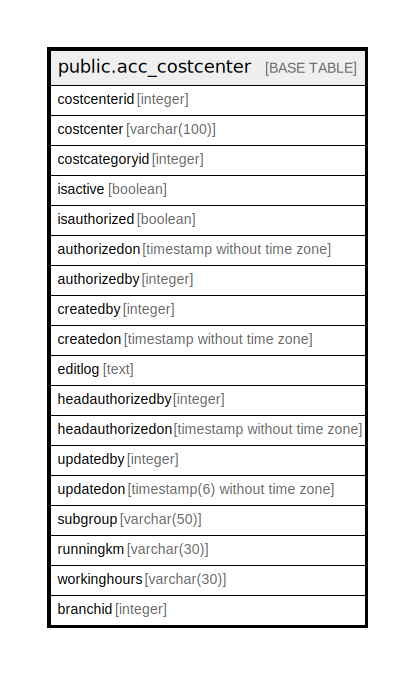

# public.acc_costcenter

## Description

## Columns

| Name | Type | Default | Nullable | Children | Parents | Comment |
| ---- | ---- | ------- | -------- | -------- | ------- | ------- |
| costcenterid | integer | nextval('acc_costcentermaster_costcenterid_seq'::regclass) | false |  |  |  |
| costcenter | varchar(100) |  | false |  |  |  |
| costcategoryid | integer |  | true |  |  |  |
| isactive | boolean | true | false |  |  |  |
| isauthorized | boolean | false | false |  |  |  |
| authorizedon | timestamp without time zone |  | true |  |  |  |
| authorizedby | integer |  | true |  |  |  |
| createdby | integer |  | true |  |  |  |
| createdon | timestamp without time zone | now() | true |  |  |  |
| editlog | text |  | true |  |  |  |
| headauthorizedby | integer |  | true |  |  |  |
| headauthorizedon | timestamp without time zone |  | true |  |  |  |
| updatedby | integer |  | true |  |  |  |
| updatedon | timestamp(6) without time zone | NULL::timestamp without time zone | true |  |  |  |
| subgroup | varchar(50) |  | true |  |  |  |
| runningkm | varchar(30) |  | true |  |  |  |
| workinghours | varchar(30) |  | true |  |  |  |
| branchid | integer |  | true |  |  |  |

## Constraints

| Name | Type | Definition |
| ---- | ---- | ---------- |
| acc_costcentermaster_costcentername_key | UNIQUE | UNIQUE (costcenter, costcategoryid, branchid) |
| acc_costcentermaster_pkey | PRIMARY KEY | PRIMARY KEY (costcenterid) |

## Indexes

| Name | Definition |
| ---- | ---------- |
| acc_costcentermaster_costcentername_key | CREATE UNIQUE INDEX acc_costcentermaster_costcentername_key ON public.acc_costcenter USING btree (costcenter, costcategoryid, branchid) |
| acc_costcentermaster_pkey | CREATE UNIQUE INDEX acc_costcentermaster_pkey ON public.acc_costcenter USING btree (costcenterid) |

## Relations

---

> Generated by [tbls](https://github.com/k1LoW/tbls)
