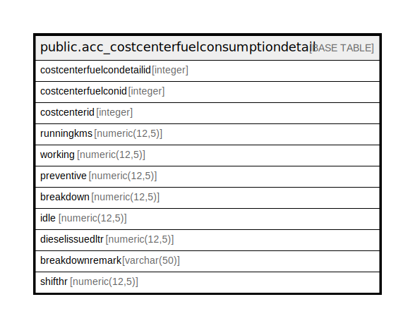

# public.acc_costcenterfuelconsumptiondetail

## Description

## Columns

| Name | Type | Default | Nullable | Children | Parents | Comment |
| ---- | ---- | ------- | -------- | -------- | ------- | ------- |
| costcenterfuelcondetailid | integer | nextval('acc_costcenterfuelconsumptiondeta_costcenterfuelcondetailid_seq'::regclass) | false |  |  |  |
| costcenterfuelconid | integer |  | true |  |  |  |
| costcenterid | integer |  | true |  |  |  |
| runningkms | numeric(12,5) |  | true |  |  |  |
| working | numeric(12,5) |  | true |  |  |  |
| preventive | numeric(12,5) |  | true |  |  |  |
| breakdown | numeric(12,5) |  | true |  |  |  |
| idle | numeric(12,5) |  | true |  |  |  |
| dieselissuedltr | numeric(12,5) |  | true |  |  |  |
| breakdownremark | varchar(50) |  | true |  |  |  |
| shifthr | numeric(12,5) |  | true |  |  |  |

## Relations

---

> Generated by [tbls](https://github.com/k1LoW/tbls)
