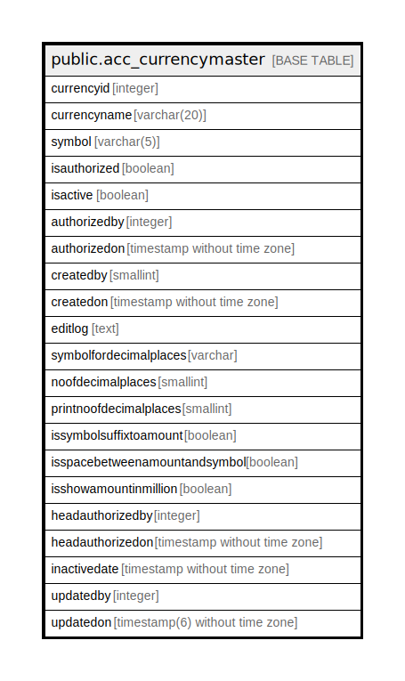

# public.acc_currencymaster

## Description

## Columns

| Name | Type | Default | Nullable | Children | Parents | Comment |
| ---- | ---- | ------- | -------- | -------- | ------- | ------- |
| currencyid | integer | nextval('acc_currencymaster_currencyid_seq'::regclass) | false |  |  |  |
| currencyname | varchar(20) |  | false |  |  |  |
| symbol | varchar(5) |  | false |  |  |  |
| isauthorized | boolean | false | false |  |  |  |
| isactive | boolean | true | false |  |  |  |
| authorizedby | integer |  | true |  |  |  |
| authorizedon | timestamp without time zone |  | true |  |  |  |
| createdby | smallint |  | true |  |  |  |
| createdon | timestamp without time zone | now() | true |  |  |  |
| editlog | text |  | true |  |  |  |
| symbolfordecimalplaces | varchar |  | true |  |  |  |
| noofdecimalplaces | smallint | 2 | true |  |  |  |
| printnoofdecimalplaces | smallint | 2 | true |  |  |  |
| issymbolsuffixtoamount | boolean | true | true |  |  |  |
| isspacebetweenamountandsymbol | boolean | true | true |  |  |  |
| isshowamountinmillion | boolean | false | true |  |  |  |
| headauthorizedby | integer |  | true |  |  |  |
| headauthorizedon | timestamp without time zone |  | true |  |  |  |
| inactivedate | timestamp without time zone |  | true |  |  |  |
| updatedby | integer |  | true |  |  |  |
| updatedon | timestamp(6) without time zone | NULL::timestamp without time zone | true |  |  |  |

## Constraints

| Name | Type | Definition |
| ---- | ---- | ---------- |
| currencymaster_currencyname_key | UNIQUE | UNIQUE (currencyname) |
| currencymaster_pkey | PRIMARY KEY | PRIMARY KEY (currencyid) |

## Indexes

| Name | Definition |
| ---- | ---------- |
| currencymaster_currencyname_key | CREATE UNIQUE INDEX currencymaster_currencyname_key ON public.acc_currencymaster USING btree (currencyname) |
| currencymaster_pkey | CREATE UNIQUE INDEX currencymaster_pkey ON public.acc_currencymaster USING btree (currencyid) |

## Relations

---

> Generated by [tbls](https://github.com/k1LoW/tbls)
