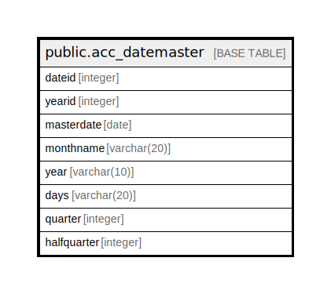

# public.acc_datemaster

## Description

## Columns

| Name | Type | Default | Nullable | Children | Parents | Comment |
| ---- | ---- | ------- | -------- | -------- | ------- | ------- |
| dateid | integer | nextval('acc_datemaster_dateid_seq'::regclass) | false |  |  |  |
| yearid | integer |  | true |  |  |  |
| masterdate | date |  | true |  |  |  |
| monthname | varchar(20) |  | true |  |  |  |
| year | varchar(10) |  | true |  |  |  |
| days | varchar(20) |  | true |  |  |  |
| quarter | integer |  | true |  |  |  |
| halfquarter | integer |  | true |  |  |  |

## Constraints

| Name | Type | Definition |
| ---- | ---- | ---------- |
| acc_datemaster_pkey | PRIMARY KEY | PRIMARY KEY (dateid) |

## Indexes

| Name | Definition |
| ---- | ---------- |
| acc_datemaster_pkey | CREATE UNIQUE INDEX acc_datemaster_pkey ON public.acc_datemaster USING btree (dateid) |

## Relations

---

> Generated by [tbls](https://github.com/k1LoW/tbls)
