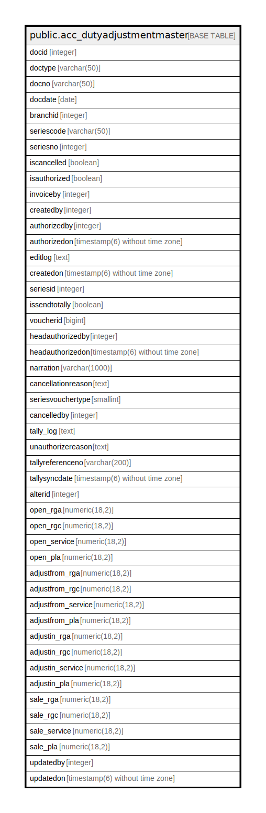

# public.acc_dutyadjustmentmaster

## Description

## Columns

| Name | Type | Default | Nullable | Children | Parents | Comment |
| ---- | ---- | ------- | -------- | -------- | ------- | ------- |
| docid | integer | nextval('acc_dutyadjustmentmaster_docid_seq'::regclass) | false |  |  |  |
| doctype | varchar(50) |  | true |  |  |  |
| docno | varchar(50) |  | true |  |  |  |
| docdate | date |  | true |  |  |  |
| branchid | integer |  | true |  |  |  |
| seriescode | varchar(50) |  | true |  |  |  |
| seriesno | integer |  | true |  |  |  |
| iscancelled | boolean | false | true |  |  |  |
| isauthorized | boolean | false | true |  |  |  |
| invoiceby | integer |  | true |  |  |  |
| createdby | integer |  | true |  |  |  |
| authorizedby | integer |  | true |  |  |  |
| authorizedon | timestamp(6) without time zone | now() | true |  |  |  |
| editlog | text |  | true |  |  |  |
| createdon | timestamp(6) without time zone | now() | true |  |  |  |
| seriesid | integer |  | true |  |  |  |
| issendtotally | boolean | false | true |  |  |  |
| voucherid | bigint |  | true |  |  |  |
| headauthorizedby | integer |  | true |  |  |  |
| headauthorizedon | timestamp(6) without time zone |  | true |  |  |  |
| narration | varchar(1000) | ''::character varying | true |  |  |  |
| cancellationreason | text |  | true |  |  |  |
| seriesvouchertype | smallint | 0 | true |  |  |  |
| cancelledby | integer |  | true |  |  |  |
| tally_log | text | ''::text | true |  |  |  |
| unauthorizereason | text |  | true |  |  |  |
| tallyreferenceno | varchar(200) |  | true |  |  |  |
| tallysyncdate | timestamp(6) without time zone |  | true |  |  |  |
| alterid | integer |  | true |  |  |  |
| open_rga | numeric(18,2) | 0 | true |  |  |  |
| open_rgc | numeric(18,2) | 0 | true |  |  |  |
| open_service | numeric(18,2) | 0 | true |  |  |  |
| open_pla | numeric(18,2) | 0 | true |  |  |  |
| adjustfrom_rga | numeric(18,2) | 0 | true |  |  |  |
| adjustfrom_rgc | numeric(18,2) | 0 | true |  |  |  |
| adjustfrom_service | numeric(18,2) | 0 | true |  |  |  |
| adjustfrom_pla | numeric(18,2) | 0 | true |  |  |  |
| adjustin_rga | numeric(18,2) | 0 | true |  |  |  |
| adjustin_rgc | numeric(18,2) | 0 | true |  |  |  |
| adjustin_service | numeric(18,2) | 0 | true |  |  |  |
| adjustin_pla | numeric(18,2) | 0 | true |  |  |  |
| sale_rga | numeric(18,2) | 0 | true |  |  |  |
| sale_rgc | numeric(18,2) | 0 | true |  |  |  |
| sale_service | numeric(18,2) | 0 | true |  |  |  |
| sale_pla | numeric(18,2) | 0 | true |  |  |  |
| updatedby | integer |  | true |  |  |  |
| updatedon | timestamp(6) without time zone | NULL::timestamp without time zone | true |  |  |  |

## Constraints

| Name | Type | Definition |
| ---- | ---- | ---------- |
| acc_dutyadjustmentmaster_pkey | PRIMARY KEY | PRIMARY KEY (docid) |

## Indexes

| Name | Definition |
| ---- | ---------- |
| acc_dutyadjustmentmaster_pkey | CREATE UNIQUE INDEX acc_dutyadjustmentmaster_pkey ON public.acc_dutyadjustmentmaster USING btree (docid) |

## Relations

---

> Generated by [tbls](https://github.com/k1LoW/tbls)
