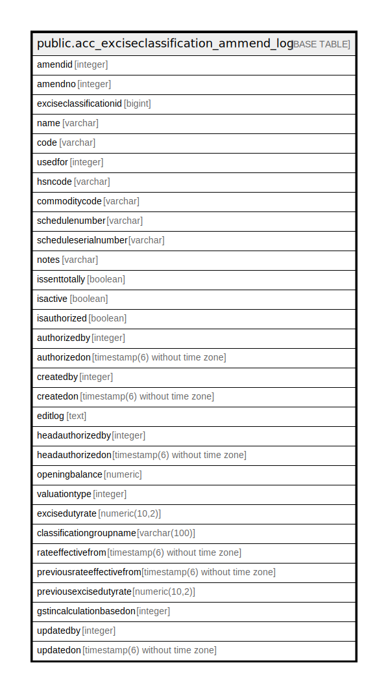

# public.acc_exciseclassification_ammend_log

## Description

## Columns

| Name | Type | Default | Nullable | Children | Parents | Comment |
| ---- | ---- | ------- | -------- | -------- | ------- | ------- |
| amendid | integer | nextval('acc_exciseclassification_ammend_log_amendid_seq'::regclass) | false |  |  |  |
| amendno | integer |  | true |  |  |  |
| exciseclassificationid | bigint |  | false |  |  |  |
| name | varchar |  | false |  |  |  |
| code | varchar |  | true |  |  |  |
| usedfor | integer |  | false |  |  |  |
| hsncode | varchar |  | true |  |  |  |
| commoditycode | varchar |  | true |  |  |  |
| schedulenumber | varchar |  | true |  |  |  |
| scheduleserialnumber | varchar |  | true |  |  |  |
| notes | varchar |  | true |  |  |  |
| issenttotally | boolean | false | true |  |  |  |
| isactive | boolean | true | true |  |  |  |
| isauthorized | boolean | false | false |  |  |  |
| authorizedby | integer |  | true |  |  |  |
| authorizedon | timestamp(6) without time zone |  | true |  |  |  |
| createdby | integer |  | true |  |  |  |
| createdon | timestamp(6) without time zone | now() | true |  |  |  |
| editlog | text |  | true |  |  |  |
| headauthorizedby | integer |  | true |  |  |  |
| headauthorizedon | timestamp(6) without time zone |  | true |  |  |  |
| openingbalance | numeric | 0 | true |  |  |  |
| valuationtype | integer | 2 | true |  |  |  |
| excisedutyrate | numeric(10,2) |  | true |  |  |  |
| classificationgroupname | varchar(100) |  | true |  |  |  |
| rateeffectivefrom | timestamp(6) without time zone |  | true |  |  |  |
| previousrateeffectivefrom | timestamp(6) without time zone |  | true |  |  |  |
| previousexcisedutyrate | numeric(10,2) |  | true |  |  |  |
| gstincalculationbasedon | integer |  | true |  |  |  |
| updatedby | integer |  | true |  |  |  |
| updatedon | timestamp(6) without time zone | NULL::timestamp without time zone | true |  |  |  |

## Relations

---

> Generated by [tbls](https://github.com/k1LoW/tbls)
