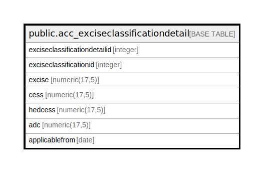

# public.acc_exciseclassificationdetail

## Description

## Columns

| Name | Type | Default | Nullable | Children | Parents | Comment |
| ---- | ---- | ------- | -------- | -------- | ------- | ------- |
| exciseclassificationdetailid | integer | nextval('acc_exciseclassificationdetail_exciseclassificationdetailid_seq'::regclass) | false |  |  |  |
| exciseclassificationid | integer |  | true |  |  |  |
| excise | numeric(17,5) | 0 | true |  |  |  |
| cess | numeric(17,5) | 0 | true |  |  |  |
| hedcess | numeric(17,5) | 0 | true |  |  |  |
| adc | numeric(17,5) | 0 | true |  |  |  |
| applicablefrom | date |  | true |  |  |  |

## Constraints

| Name | Type | Definition |
| ---- | ---- | ---------- |
| acc_exciseclassificationdetail_pkey | PRIMARY KEY | PRIMARY KEY (exciseclassificationdetailid) |

## Indexes

| Name | Definition |
| ---- | ---------- |
| acc_exciseclassificationdetail_pkey | CREATE UNIQUE INDEX acc_exciseclassificationdetail_pkey ON public.acc_exciseclassificationdetail USING btree (exciseclassificationdetailid) |

## Relations

---

> Generated by [tbls](https://github.com/k1LoW/tbls)
