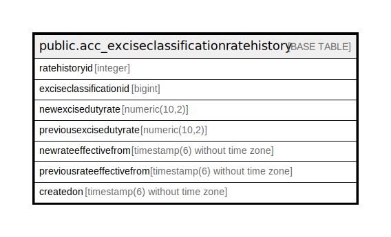

# public.acc_exciseclassificationratehistory

## Description

## Columns

| Name | Type | Default | Nullable | Children | Parents | Comment |
| ---- | ---- | ------- | -------- | -------- | ------- | ------- |
| ratehistoryid | integer | nextval('acc_exciseclassificationratehistory_ratehistoryid_seq'::regclass) | false |  |  |  |
| exciseclassificationid | bigint |  | true |  |  |  |
| newexcisedutyrate | numeric(10,2) |  | true |  |  |  |
| previousexcisedutyrate | numeric(10,2) |  | true |  |  |  |
| newrateeffectivefrom | timestamp(6) without time zone |  | true |  |  |  |
| previousrateeffectivefrom | timestamp(6) without time zone |  | true |  |  |  |
| createdon | timestamp(6) without time zone | now() | true |  |  |  |

## Constraints

| Name | Type | Definition |
| ---- | ---- | ---------- |
| acc_exciseclassificationratehistory_pkey | PRIMARY KEY | PRIMARY KEY (ratehistoryid) |

## Indexes

| Name | Definition |
| ---- | ---------- |
| acc_exciseclassificationratehistory_pkey | CREATE UNIQUE INDEX acc_exciseclassificationratehistory_pkey ON public.acc_exciseclassificationratehistory USING btree (ratehistoryid) |

## Relations

---

> Generated by [tbls](https://github.com/k1LoW/tbls)
