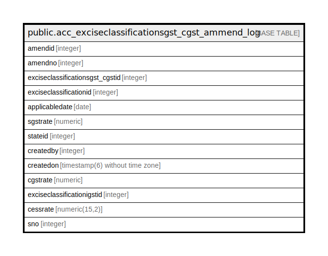

# public.acc_exciseclassificationsgst_cgst_ammend_log

## Description

## Columns

| Name | Type | Default | Nullable | Children | Parents | Comment |
| ---- | ---- | ------- | -------- | -------- | ------- | ------- |
| amendid | integer | nextval('acc_exciseclassificationsgst_cgst_ammend_log_amendid_seq'::regclass) | false |  |  |  |
| amendno | integer |  | true |  |  |  |
| exciseclassificationsgst_cgstid | integer |  | false |  |  |  |
| exciseclassificationid | integer |  | true |  |  |  |
| applicabledate | date |  | true |  |  |  |
| sgstrate | numeric |  | true |  |  |  |
| stateid | integer |  | true |  |  |  |
| createdby | integer |  | true |  |  |  |
| createdon | timestamp(6) without time zone | now() | true |  |  |  |
| cgstrate | numeric |  | true |  |  |  |
| exciseclassificationigstid | integer |  | true |  |  |  |
| cessrate | numeric(15,2) | 0 | false |  |  |  |
| sno | integer |  | true |  |  |  |

## Relations

---

> Generated by [tbls](https://github.com/k1LoW/tbls)
