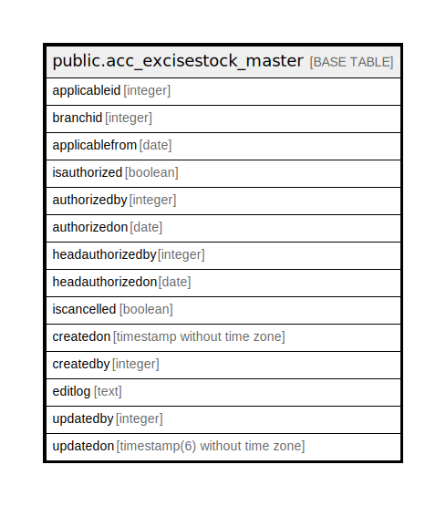

# public.acc_excisestock_master

## Description

## Columns

| Name | Type | Default | Nullable | Children | Parents | Comment |
| ---- | ---- | ------- | -------- | -------- | ------- | ------- |
| applicableid | integer | nextval('acc_excisestock_master_applicableid_seq'::regclass) | false |  |  |  |
| branchid | integer |  | true |  |  |  |
| applicablefrom | date |  | true |  |  |  |
| isauthorized | boolean |  | true |  |  |  |
| authorizedby | integer |  | true |  |  |  |
| authorizedon | date |  | true |  |  |  |
| headauthorizedby | integer |  | true |  |  |  |
| headauthorizedon | date |  | true |  |  |  |
| iscancelled | boolean | false | true |  |  |  |
| createdon | timestamp without time zone | now() | true |  |  |  |
| createdby | integer |  | true |  |  |  |
| editlog | text |  | true |  |  |  |
| updatedby | integer |  | true |  |  |  |
| updatedon | timestamp(6) without time zone | NULL::timestamp without time zone | true |  |  |  |

## Constraints

| Name | Type | Definition |
| ---- | ---- | ---------- |
| acc_excisestock_master_pkey | PRIMARY KEY | PRIMARY KEY (applicableid) |

## Indexes

| Name | Definition |
| ---- | ---------- |
| acc_excisestock_master_pkey | CREATE UNIQUE INDEX acc_excisestock_master_pkey ON public.acc_excisestock_master USING btree (applicableid) |

## Relations

---

> Generated by [tbls](https://github.com/k1LoW/tbls)
