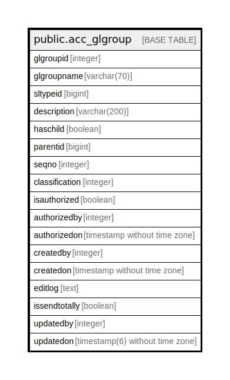

# public.acc_glgroup

## Description

## Columns

| Name | Type | Default | Nullable | Children | Parents | Comment |
| ---- | ---- | ------- | -------- | -------- | ------- | ------- |
| glgroupid | integer | nextval('acc_glgroup_glgroupid_seq'::regclass) | false |  |  |  |
| glgroupname | varchar(70) |  | true |  |  |  |
| sltypeid | bigint |  | true |  |  |  |
| description | varchar(200) |  | true |  |  |  |
| haschild | boolean |  | true |  |  |  |
| parentid | bigint |  | true |  |  |  |
| seqno | integer | 0 | true |  |  |  |
| classification | integer |  | true |  |  |  |
| isauthorized | boolean | false | true |  |  |  |
| authorizedby | integer |  | true |  |  |  |
| authorizedon | timestamp without time zone |  | true |  |  |  |
| createdby | integer |  | true |  |  |  |
| createdon | timestamp without time zone | now() | true |  |  |  |
| editlog | text |  | true |  |  |  |
| issendtotally | boolean | false | true |  |  |  |
| updatedby | integer |  | true |  |  |  |
| updatedon | timestamp(6) without time zone | NULL::timestamp without time zone | true |  |  |  |

## Constraints

| Name | Type | Definition |
| ---- | ---- | ---------- |
| glgroup_glgroupname_key | UNIQUE | UNIQUE (glgroupname) |
| glgroup_pkey | PRIMARY KEY | PRIMARY KEY (glgroupid) |

## Indexes

| Name | Definition |
| ---- | ---------- |
| glgroup_glgroupname_key | CREATE UNIQUE INDEX glgroup_glgroupname_key ON public.acc_glgroup USING btree (glgroupname) |
| glgroup_pkey | CREATE UNIQUE INDEX glgroup_pkey ON public.acc_glgroup USING btree (glgroupid) |

## Relations

---

> Generated by [tbls](https://github.com/k1LoW/tbls)
