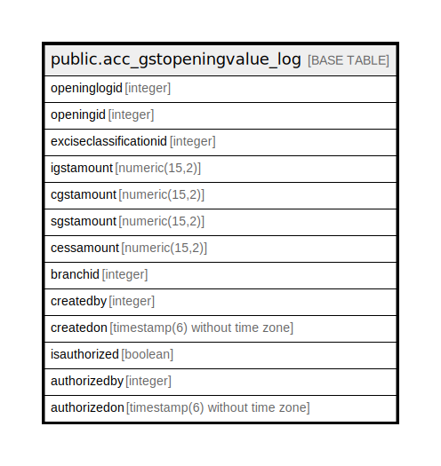

# public.acc_gstopeningvalue_log

## Description

## Columns

| Name | Type | Default | Nullable | Children | Parents | Comment |
| ---- | ---- | ------- | -------- | -------- | ------- | ------- |
| openinglogid | integer | nextval('acc_gstopeningvalue_log_openinglogid_seq'::regclass) | false |  |  |  |
| openingid | integer |  | true |  |  |  |
| exciseclassificationid | integer | 0 | false |  |  |  |
| igstamount | numeric(15,2) | 0 | false |  |  |  |
| cgstamount | numeric(15,2) | 0 | false |  |  |  |
| sgstamount | numeric(15,2) | 0 | false |  |  |  |
| cessamount | numeric(15,2) | 0 | false |  |  |  |
| branchid | integer |  | true |  |  |  |
| createdby | integer | 0 | false |  |  |  |
| createdon | timestamp(6) without time zone |  | true |  |  |  |
| isauthorized | boolean | false | false |  |  |  |
| authorizedby | integer |  | true |  |  |  |
| authorizedon | timestamp(6) without time zone |  | true |  |  |  |

## Constraints

| Name | Type | Definition |
| ---- | ---- | ---------- |
| acc_gstopeningvalue_log_pkey | PRIMARY KEY | PRIMARY KEY (openinglogid) |

## Indexes

| Name | Definition |
| ---- | ---------- |
| acc_gstopeningvalue_log_pkey | CREATE UNIQUE INDEX acc_gstopeningvalue_log_pkey ON public.acc_gstopeningvalue_log USING btree (openinglogid) |

## Relations

---

> Generated by [tbls](https://github.com/k1LoW/tbls)
