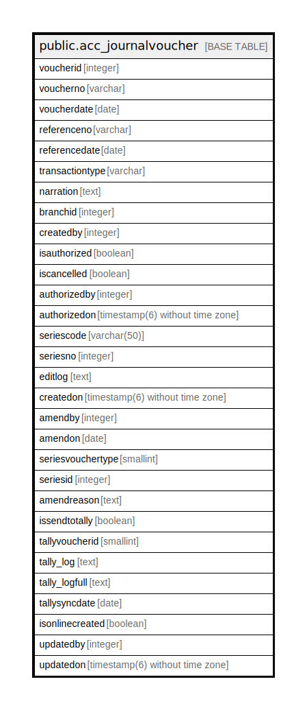

# public.acc_journalvoucher

## Description

## Columns

| Name | Type | Default | Nullable | Children | Parents | Comment |
| ---- | ---- | ------- | -------- | -------- | ------- | ------- |
| voucherid | integer | nextval('acc_journalvoucher_voucherid_seq'::regclass) | false |  |  |  |
| voucherno | varchar |  | true |  |  |  |
| voucherdate | date |  | true |  |  |  |
| referenceno | varchar |  | true |  |  |  |
| referencedate | date |  | true |  |  |  |
| transactiontype | varchar |  | true |  |  |  |
| narration | text |  | true |  |  |  |
| branchid | integer |  | true |  |  |  |
| createdby | integer |  | false |  |  |  |
| isauthorized | boolean | false | false |  |  |  |
| iscancelled | boolean | false | false |  |  |  |
| authorizedby | integer |  | true |  |  |  |
| authorizedon | timestamp(6) without time zone |  | true |  |  |  |
| seriescode | varchar(50) |  | true |  |  |  |
| seriesno | integer |  | true |  |  |  |
| editlog | text |  | true |  |  |  |
| createdon | timestamp(6) without time zone | now() | true |  |  |  |
| amendby | integer |  | true |  |  |  |
| amendon | date |  | true |  |  |  |
| seriesvouchertype | smallint | 0 | true |  |  |  |
| seriesid | integer |  | true |  |  |  |
| amendreason | text |  | true |  |  |  |
| issendtotally | boolean | false | true |  |  |  |
| tallyvoucherid | smallint | 0 | true |  |  |  |
| tally_log | text |  | true |  |  |  |
| tally_logfull | text |  | true |  |  |  |
| tallysyncdate | date |  | true |  |  |  |
| isonlinecreated | boolean | false | true |  |  |  |
| updatedby | integer |  | true |  |  |  |
| updatedon | timestamp(6) without time zone | NULL::timestamp without time zone | true |  |  |  |

## Constraints

| Name | Type | Definition |
| ---- | ---- | ---------- |
| acc_journalvoucher_pkey | PRIMARY KEY | PRIMARY KEY (voucherid) |

## Indexes

| Name | Definition |
| ---- | ---------- |
| acc_journalvoucher_pkey | CREATE UNIQUE INDEX acc_journalvoucher_pkey ON public.acc_journalvoucher USING btree (voucherid) |

## Relations

---

> Generated by [tbls](https://github.com/k1LoW/tbls)
