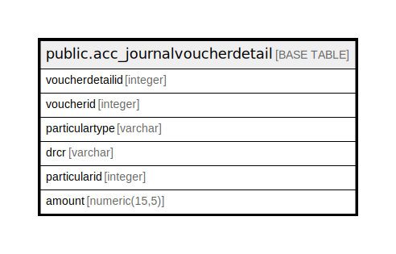

# public.acc_journalvoucherdetail

## Description

## Columns

| Name | Type | Default | Nullable | Children | Parents | Comment |
| ---- | ---- | ------- | -------- | -------- | ------- | ------- |
| voucherdetailid | integer | nextval('acc_journalvoucherdetail_voucherdetailid_seq'::regclass) | false |  |  |  |
| voucherid | integer |  | true |  |  |  |
| particulartype | varchar |  | true |  |  |  |
| drcr | varchar |  | true |  |  |  |
| particularid | integer |  | true |  |  |  |
| amount | numeric(15,5) |  | true |  |  |  |

## Constraints

| Name | Type | Definition |
| ---- | ---- | ---------- |
| acc_journalvoucherdetail_pkey | PRIMARY KEY | PRIMARY KEY (voucherdetailid) |

## Indexes

| Name | Definition |
| ---- | ---------- |
| acc_journalvoucherdetail_pkey | CREATE UNIQUE INDEX acc_journalvoucherdetail_pkey ON public.acc_journalvoucherdetail USING btree (voucherdetailid) |

## Relations

---

> Generated by [tbls](https://github.com/k1LoW/tbls)
