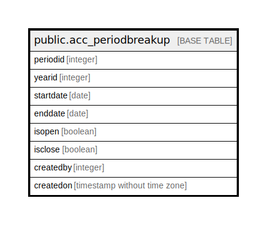

# public.acc_periodbreakup

## Description

## Columns

| Name | Type | Default | Nullable | Children | Parents | Comment |
| ---- | ---- | ------- | -------- | -------- | ------- | ------- |
| periodid | integer | nextval('acc_periodbreakup_periodid_seq'::regclass) | false |  |  |  |
| yearid | integer |  | true |  |  |  |
| startdate | date |  | true |  |  |  |
| enddate | date |  | true |  |  |  |
| isopen | boolean | false | true |  |  |  |
| isclose | boolean | false | true |  |  |  |
| createdby | integer |  | true |  |  |  |
| createdon | timestamp without time zone | now() | true |  |  |  |

## Constraints

| Name | Type | Definition |
| ---- | ---- | ---------- |
| acc_periodbreakup_pkey | PRIMARY KEY | PRIMARY KEY (periodid) |

## Indexes

| Name | Definition |
| ---- | ---------- |
| acc_periodbreakup_pkey | CREATE UNIQUE INDEX acc_periodbreakup_pkey ON public.acc_periodbreakup USING btree (periodid) |

## Relations

---

> Generated by [tbls](https://github.com/k1LoW/tbls)
