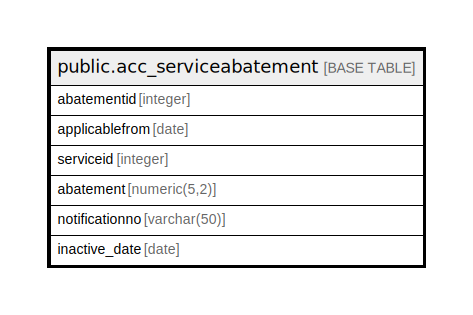

# public.acc_serviceabatement

## Description

## Columns

| Name | Type | Default | Nullable | Children | Parents | Comment |
| ---- | ---- | ------- | -------- | -------- | ------- | ------- |
| abatementid | integer | nextval('acc_serviceabatement_abatementid_seq'::regclass) | false |  |  |  |
| applicablefrom | date |  | true |  |  |  |
| serviceid | integer |  | true |  |  |  |
| abatement | numeric(5,2) |  | true |  |  |  |
| notificationno | varchar(50) |  | true |  |  |  |
| inactive_date | date |  | true |  |  |  |

## Constraints

| Name | Type | Definition |
| ---- | ---- | ---------- |
| acc_serviceabatement_pkey | PRIMARY KEY | PRIMARY KEY (abatementid) |

## Indexes

| Name | Definition |
| ---- | ---------- |
| acc_serviceabatement_pkey | CREATE UNIQUE INDEX acc_serviceabatement_pkey ON public.acc_serviceabatement USING btree (abatementid) |

## Relations

---

> Generated by [tbls](https://github.com/k1LoW/tbls)
