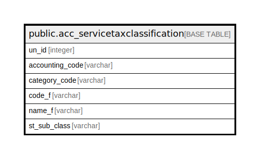

# public.acc_servicetaxclassification

## Description

## Columns

| Name | Type | Default | Nullable | Children | Parents | Comment |
| ---- | ---- | ------- | -------- | -------- | ------- | ------- |
| un_id | integer | nextval('acc_servicetaxclassification_un_id_seq'::regclass) | false |  |  |  |
| accounting_code | varchar |  | true |  |  |  |
| category_code | varchar |  | true |  |  |  |
| code_f | varchar |  | true |  |  |  |
| name_f | varchar |  | true |  |  |  |
| st_sub_class | varchar |  | true |  |  |  |

## Constraints

| Name | Type | Definition |
| ---- | ---- | ---------- |
| acc_servicetaxclassification_pkey | PRIMARY KEY | PRIMARY KEY (un_id) |

## Indexes

| Name | Definition |
| ---- | ---------- |
| acc_servicetaxclassification_pkey | CREATE UNIQUE INDEX acc_servicetaxclassification_pkey ON public.acc_servicetaxclassification USING btree (un_id) |

## Relations

---

> Generated by [tbls](https://github.com/k1LoW/tbls)
