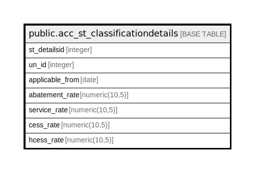

# public.acc_st_classificationdetails

## Description

## Columns

| Name | Type | Default | Nullable | Children | Parents | Comment |
| ---- | ---- | ------- | -------- | -------- | ------- | ------- |
| st_detailsid | integer | nextval('acc_st_classificationdetails_st_detailsid_seq'::regclass) | false |  |  |  |
| un_id | integer |  | true |  |  |  |
| applicable_from | date |  | true |  |  |  |
| abatement_rate | numeric(10,5) |  | true |  |  |  |
| service_rate | numeric(10,5) |  | true |  |  |  |
| cess_rate | numeric(10,5) |  | true |  |  |  |
| hcess_rate | numeric(10,5) |  | true |  |  |  |

## Constraints

| Name | Type | Definition |
| ---- | ---- | ---------- |
| acc_st_taxdetails_pkey | PRIMARY KEY | PRIMARY KEY (st_detailsid) |

## Indexes

| Name | Definition |
| ---- | ---------- |
| acc_st_taxdetails_pkey | CREATE UNIQUE INDEX acc_st_taxdetails_pkey ON public.acc_st_classificationdetails USING btree (st_detailsid) |

## Relations

---

> Generated by [tbls](https://github.com/k1LoW/tbls)
