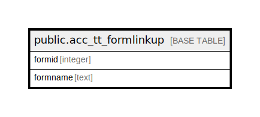

# public.acc_tt_formlinkup

## Description

## Columns

| Name | Type | Default | Nullable | Children | Parents | Comment |
| ---- | ---- | ------- | -------- | -------- | ------- | ------- |
| formid | integer |  | true |  |  |  |
| formname | text |  | true |  |  |  |

## Constraints

| Name | Type | Definition |
| ---- | ---- | ---------- |
| frmunique | UNIQUE | UNIQUE (formid) |

## Indexes

| Name | Definition |
| ---- | ---------- |
| frmunique | CREATE UNIQUE INDEX frmunique ON public.acc_tt_formlinkup USING btree (formid) |

## Relations

---

> Generated by [tbls](https://github.com/k1LoW/tbls)
