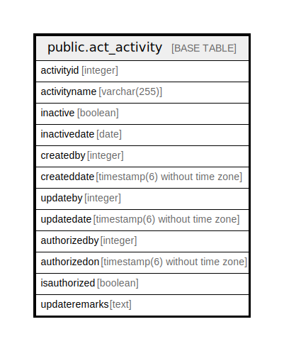

# public.act_activity

## Description

## Columns

| Name | Type | Default | Nullable | Children | Parents | Comment |
| ---- | ---- | ------- | -------- | -------- | ------- | ------- |
| activityid | integer | nextval('act_activity_activityid_seq'::regclass) | false |  |  |  |
| activityname | varchar(255) |  | true |  |  |  |
| inactive | boolean | false | true |  |  |  |
| inactivedate | date |  | true |  |  |  |
| createdby | integer |  | true |  |  |  |
| createddate | timestamp(6) without time zone | now() | true |  |  |  |
| updateby | integer |  | true |  |  |  |
| updatedate | timestamp(6) without time zone |  | true |  |  |  |
| authorizedby | integer |  | true |  |  |  |
| authorizedon | timestamp(6) without time zone |  | true |  |  |  |
| isauthorized | boolean | false | true |  |  |  |
| updateremarks | text |  | true |  |  |  |

## Constraints

| Name | Type | Definition |
| ---- | ---- | ---------- |
| act_activity_pkey | PRIMARY KEY | PRIMARY KEY (activityid) |

## Indexes

| Name | Definition |
| ---- | ---------- |
| act_activity_pkey | CREATE UNIQUE INDEX act_activity_pkey ON public.act_activity USING btree (activityid) |

## Relations

---

> Generated by [tbls](https://github.com/k1LoW/tbls)
