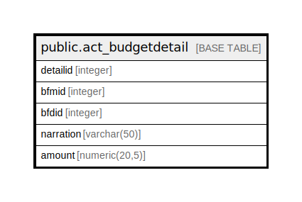

# public.act_budgetdetail

## Description

## Columns

| Name | Type | Default | Nullable | Children | Parents | Comment |
| ---- | ---- | ------- | -------- | -------- | ------- | ------- |
| detailid | integer | nextval('act_budgetdetail_detailid_seq'::regclass) | false |  |  |  |
| bfmid | integer |  | true |  |  |  |
| bfdid | integer |  | true |  |  |  |
| narration | varchar(50) |  | true |  |  |  |
| amount | numeric(20,5) |  | true |  |  |  |

## Constraints

| Name | Type | Definition |
| ---- | ---- | ---------- |
| pk_act_budgetdetail_detailid | PRIMARY KEY | PRIMARY KEY (detailid) |

## Indexes

| Name | Definition |
| ---- | ---------- |
| pk_act_budgetdetail_detailid | CREATE UNIQUE INDEX pk_act_budgetdetail_detailid ON public.act_budgetdetail USING btree (detailid) |

## Relations

---

> Generated by [tbls](https://github.com/k1LoW/tbls)
