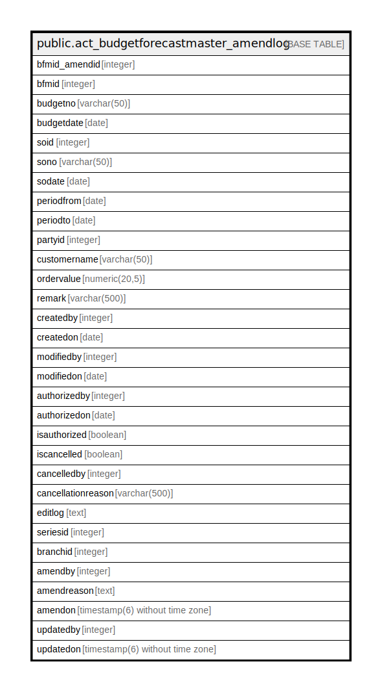

# public.act_budgetforecastmaster_amendlog

## Description

## Columns

| Name | Type | Default | Nullable | Children | Parents | Comment |
| ---- | ---- | ------- | -------- | -------- | ------- | ------- |
| bfmid_amendid | integer | nextval('act_budgetforecastmaster_amendlog_bfmid_amendid_seq'::regclass) | false |  |  |  |
| bfmid | integer |  | true |  |  |  |
| budgetno | varchar(50) |  | true |  |  |  |
| budgetdate | date |  | true |  |  |  |
| soid | integer |  | true |  |  |  |
| sono | varchar(50) |  | true |  |  |  |
| sodate | date |  | true |  |  |  |
| periodfrom | date |  | true |  |  |  |
| periodto | date |  | true |  |  |  |
| partyid | integer |  | true |  |  |  |
| customername | varchar(50) |  | true |  |  |  |
| ordervalue | numeric(20,5) |  | true |  |  |  |
| remark | varchar(500) |  | true |  |  |  |
| createdby | integer |  | true |  |  |  |
| createdon | date |  | true |  |  |  |
| modifiedby | integer |  | true |  |  |  |
| modifiedon | date |  | true |  |  |  |
| authorizedby | integer |  | true |  |  |  |
| authorizedon | date |  | true |  |  |  |
| isauthorized | boolean |  | true |  |  |  |
| iscancelled | boolean |  | true |  |  |  |
| cancelledby | integer |  | true |  |  |  |
| cancellationreason | varchar(500) |  | true |  |  |  |
| editlog | text |  | true |  |  |  |
| seriesid | integer |  | true |  |  |  |
| branchid | integer |  | true |  |  |  |
| amendby | integer |  | true |  |  |  |
| amendreason | text |  | true |  |  |  |
| amendon | timestamp(6) without time zone | NULL::timestamp without time zone | true |  |  |  |
| updatedby | integer |  | true |  |  |  |
| updatedon | timestamp(6) without time zone | NULL::timestamp without time zone | true |  |  |  |

## Constraints

| Name | Type | Definition |
| ---- | ---- | ---------- |
| pk_act_budgetforecastmaster_amendlog_bfmid | PRIMARY KEY | PRIMARY KEY (bfmid_amendid) |

## Indexes

| Name | Definition |
| ---- | ---------- |
| pk_act_budgetforecastmaster_amendlog_bfmid | CREATE UNIQUE INDEX pk_act_budgetforecastmaster_amendlog_bfmid ON public.act_budgetforecastmaster_amendlog USING btree (bfmid_amendid) |

## Relations

---

> Generated by [tbls](https://github.com/k1LoW/tbls)
