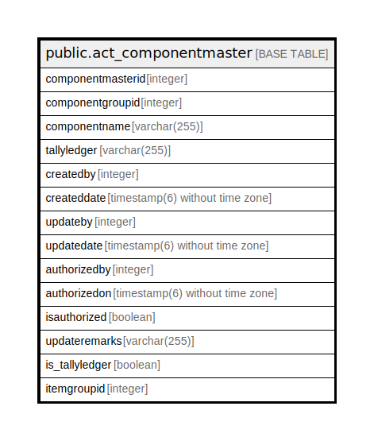

# public.act_componentmaster

## Description

## Columns

| Name | Type | Default | Nullable | Children | Parents | Comment |
| ---- | ---- | ------- | -------- | -------- | ------- | ------- |
| componentmasterid | integer | nextval('act_componentmaster_componentmasterid_seq'::regclass) | false |  |  |  |
| componentgroupid | integer |  | true |  |  |  |
| componentname | varchar(255) |  | true |  |  |  |
| tallyledger | varchar(255) |  | true |  |  |  |
| createdby | integer |  | true |  |  |  |
| createddate | timestamp(6) without time zone | now() | true |  |  |  |
| updateby | integer |  | true |  |  |  |
| updatedate | timestamp(6) without time zone |  | true |  |  |  |
| authorizedby | integer |  | true |  |  |  |
| authorizedon | timestamp(6) without time zone |  | true |  |  |  |
| isauthorized | boolean | false | true |  |  |  |
| updateremarks | varchar(255) |  | true |  |  |  |
| is_tallyledger | boolean | false | true |  |  |  |
| itemgroupid | integer |  | true |  |  |  |

## Constraints

| Name | Type | Definition |
| ---- | ---- | ---------- |
| act_componentmaster_pkey | PRIMARY KEY | PRIMARY KEY (componentmasterid) |

## Indexes

| Name | Definition |
| ---- | ---------- |
| act_componentmaster_pkey | CREATE UNIQUE INDEX act_componentmaster_pkey ON public.act_componentmaster USING btree (componentmasterid) |

## Relations

---

> Generated by [tbls](https://github.com/k1LoW/tbls)
