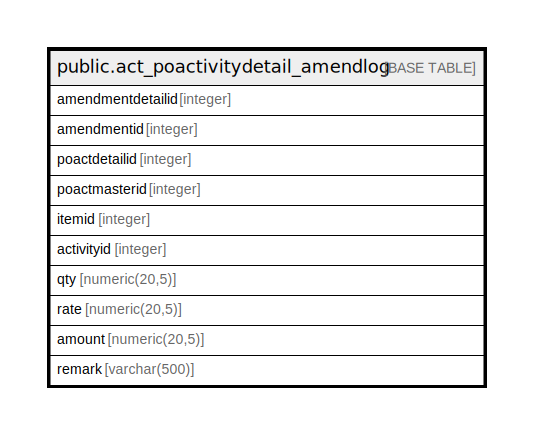

# public.act_poactivitydetail_amendlog

## Description

## Columns

| Name | Type | Default | Nullable | Children | Parents | Comment |
| ---- | ---- | ------- | -------- | -------- | ------- | ------- |
| amendmentdetailid | integer | nextval('act_poactivitydetail_amendlog_amendmentdetailid_seq'::regclass) | false |  |  |  |
| amendmentid | integer |  | true |  |  |  |
| poactdetailid | integer |  | true |  |  |  |
| poactmasterid | integer |  | true |  |  |  |
| itemid | integer | 0 | true |  |  |  |
| activityid | integer |  | true |  |  |  |
| qty | numeric(20,5) |  | true |  |  |  |
| rate | numeric(20,5) |  | true |  |  |  |
| amount | numeric(20,5) |  | true |  |  |  |
| remark | varchar(500) |  | true |  |  |  |

## Relations

---

> Generated by [tbls](https://github.com/k1LoW/tbls)
