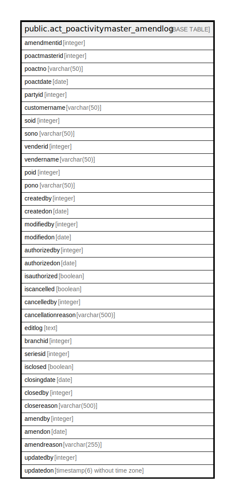

# public.act_poactivitymaster_amendlog

## Description

## Columns

| Name | Type | Default | Nullable | Children | Parents | Comment |
| ---- | ---- | ------- | -------- | -------- | ------- | ------- |
| amendmentid | integer | nextval('act_poactivitymaster_amendlog_amendmentid_seq'::regclass) | false |  |  |  |
| poactmasterid | integer |  | true |  |  |  |
| poactno | varchar(50) |  | true |  |  |  |
| poactdate | date |  | true |  |  |  |
| partyid | integer |  | true |  |  |  |
| customername | varchar(50) |  | true |  |  |  |
| soid | integer |  | true |  |  |  |
| sono | varchar(50) |  | true |  |  |  |
| venderid | integer |  | true |  |  |  |
| vendername | varchar(50) |  | true |  |  |  |
| poid | integer |  | true |  |  |  |
| pono | varchar(50) |  | true |  |  |  |
| createdby | integer | 0 | true |  |  |  |
| createdon | date |  | true |  |  |  |
| modifiedby | integer | 0 | true |  |  |  |
| modifiedon | date |  | true |  |  |  |
| authorizedby | integer | 0 | true |  |  |  |
| authorizedon | date |  | true |  |  |  |
| isauthorized | boolean | false | true |  |  |  |
| iscancelled | boolean | false | true |  |  |  |
| cancelledby | integer | 0 | true |  |  |  |
| cancellationreason | varchar(500) |  | true |  |  |  |
| editlog | text |  | true |  |  |  |
| branchid | integer |  | true |  |  |  |
| seriesid | integer |  | true |  |  |  |
| isclosed | boolean | false | true |  |  |  |
| closingdate | date |  | true |  |  |  |
| closedby | integer |  | true |  |  |  |
| closereason | varchar(500) |  | true |  |  |  |
| amendby | integer | 0 | true |  |  |  |
| amendon | date |  | true |  |  |  |
| amendreason | varchar(255) | ''::character varying | true |  |  |  |
| updatedby | integer |  | true |  |  |  |
| updatedon | timestamp(6) without time zone | NULL::timestamp without time zone | true |  |  |  |

## Relations

---

> Generated by [tbls](https://github.com/k1LoW/tbls)
