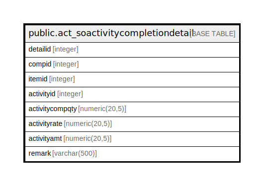

# public.act_soactivitycompletiondetail

## Description

## Columns

| Name | Type | Default | Nullable | Children | Parents | Comment |
| ---- | ---- | ------- | -------- | -------- | ------- | ------- |
| detailid | integer | nextval('act_soactivitycompletiondetail_detailid_seq'::regclass) | false |  |  |  |
| compid | integer |  | true |  |  |  |
| itemid | integer |  | true |  |  |  |
| activityid | integer |  | true |  |  |  |
| activitycompqty | numeric(20,5) |  | true |  |  |  |
| activityrate | numeric(20,5) |  | true |  |  |  |
| activityamt | numeric(20,5) |  | true |  |  |  |
| remark | varchar(500) |  | true |  |  |  |

## Constraints

| Name | Type | Definition |
| ---- | ---- | ---------- |
| pk_act_soactivitycompletiondetail_detailid | PRIMARY KEY | PRIMARY KEY (detailid) |

## Indexes

| Name | Definition |
| ---- | ---------- |
| pk_act_soactivitycompletiondetail_detailid | CREATE UNIQUE INDEX pk_act_soactivitycompletiondetail_detailid ON public.act_soactivitycompletiondetail USING btree (detailid) |

## Relations

---

> Generated by [tbls](https://github.com/k1LoW/tbls)
