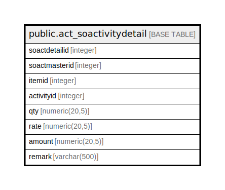

# public.act_soactivitydetail

## Description

## Columns

| Name | Type | Default | Nullable | Children | Parents | Comment |
| ---- | ---- | ------- | -------- | -------- | ------- | ------- |
| soactdetailid | integer | nextval('act_soactivitydetail_soactdetailid_seq'::regclass) | false |  |  |  |
| soactmasterid | integer |  | true |  |  |  |
| itemid | integer | 0 | true |  |  |  |
| activityid | integer |  | true |  |  |  |
| qty | numeric(20,5) |  | true |  |  |  |
| rate | numeric(20,5) |  | true |  |  |  |
| amount | numeric(20,5) |  | true |  |  |  |
| remark | varchar(500) |  | true |  |  |  |

## Constraints

| Name | Type | Definition |
| ---- | ---- | ---------- |
| pk_act_soactivitydetail_soactdetailid | PRIMARY KEY | PRIMARY KEY (soactdetailid) |

## Indexes

| Name | Definition |
| ---- | ---------- |
| pk_act_soactivitydetail_soactdetailid | CREATE UNIQUE INDEX pk_act_soactivitydetail_soactdetailid ON public.act_soactivitydetail USING btree (soactdetailid) |

## Triggers

| Name | Definition |
| ---- | ---------- |
| act_so_log_entry | CREATE TRIGGER act_so_log_entry AFTER UPDATE ON public.act_soactivitydetail FOR EACH ROW EXECUTE FUNCTION act_so_log_entry() |

## Relations

---

> Generated by [tbls](https://github.com/k1LoW/tbls)
