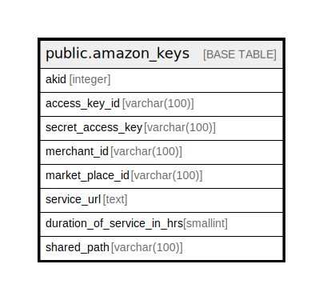

# public.amazon_keys

## Description

## Columns

| Name | Type | Default | Nullable | Children | Parents | Comment |
| ---- | ---- | ------- | -------- | -------- | ------- | ------- |
| akid | integer | nextval('amazon_keys_akid_seq'::regclass) | false |  |  |  |
| access_key_id | varchar(100) |  | true |  |  |  |
| secret_access_key | varchar(100) |  | true |  |  |  |
| merchant_id | varchar(100) |  | true |  |  |  |
| market_place_id | varchar(100) |  | true |  |  |  |
| service_url | text |  | true |  |  |  |
| duration_of_service_in_hrs | smallint | 12 | true |  |  |  |
| shared_path | varchar(100) | ''::character varying | true |  |  |  |

## Constraints

| Name | Type | Definition |
| ---- | ---- | ---------- |
| pk_amazon_keys | PRIMARY KEY | PRIMARY KEY (akid) |

## Indexes

| Name | Definition |
| ---- | ---------- |
| pk_amazon_keys | CREATE UNIQUE INDEX pk_amazon_keys ON public.amazon_keys USING btree (akid) |

## Relations

---

> Generated by [tbls](https://github.com/k1LoW/tbls)
