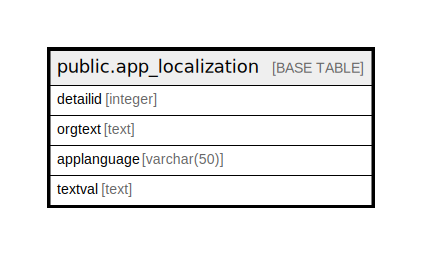

# public.app_localization

## Description

## Columns

| Name | Type | Default | Nullable | Children | Parents | Comment |
| ---- | ---- | ------- | -------- | -------- | ------- | ------- |
| detailid | integer | nextval('app_localization_detailid_seq'::regclass) | false |  |  |  |
| orgtext | text |  | false |  |  |  |
| applanguage | varchar(50) |  | true |  |  |  |
| textval | text |  | true |  |  |  |

## Constraints

| Name | Type | Definition |
| ---- | ---- | ---------- |
| pk_app_localization | PRIMARY KEY | PRIMARY KEY (detailid) |

## Indexes

| Name | Definition |
| ---- | ---------- |
| pk_app_localization | CREATE UNIQUE INDEX pk_app_localization ON public.app_localization USING btree (detailid) |

## Relations

---

> Generated by [tbls](https://github.com/k1LoW/tbls)
