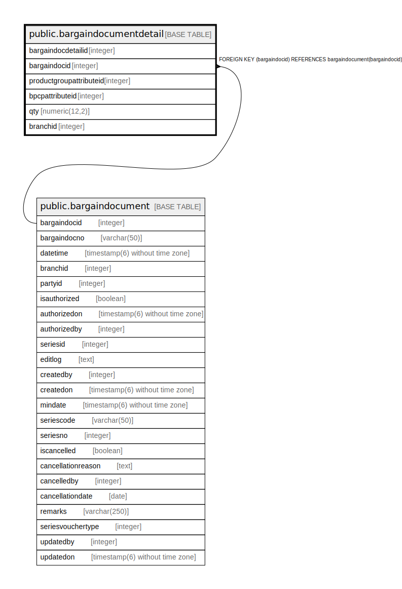

# public.bargaindocumentdetail

## Description

## Columns

| Name | Type | Default | Nullable | Children | Parents | Comment |
| ---- | ---- | ------- | -------- | -------- | ------- | ------- |
| bargaindocdetailid | integer | nextval('bargaindocumentdetail_bargaindocdetailid_seq'::regclass) | false |  |  |  |
| bargaindocid | integer |  | true |  | [public.bargaindocument](public.bargaindocument.md) |  |
| productgroupattributeid | integer |  | true |  |  |  |
| bpcpattributeid | integer |  | true |  |  |  |
| qty | numeric(12,2) | 0 | true |  |  |  |
| branchid | integer |  | true |  |  |  |

## Constraints

| Name | Type | Definition |
| ---- | ---- | ---------- |
| bargaindocumentdetail_bargaindocid_fkey | FOREIGN KEY | FOREIGN KEY (bargaindocid) REFERENCES bargaindocument(bargaindocid) |
| bargaindocumentdetail_pkey | PRIMARY KEY | PRIMARY KEY (bargaindocdetailid) |

## Indexes

| Name | Definition |
| ---- | ---------- |
| bargaindocumentdetail_pkey | CREATE UNIQUE INDEX bargaindocumentdetail_pkey ON public.bargaindocumentdetail USING btree (bargaindocdetailid) |

## Relations

---

> Generated by [tbls](https://github.com/k1LoW/tbls)
