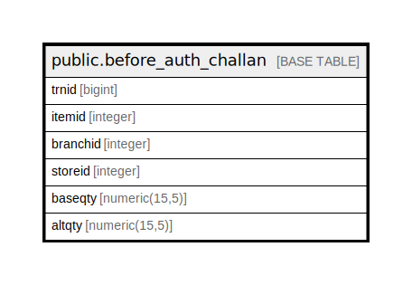

# public.before_auth_challan

## Description

## Columns

| Name | Type | Default | Nullable | Children | Parents | Comment |
| ---- | ---- | ------- | -------- | -------- | ------- | ------- |
| trnid | bigint | nextval('before_auth_challan_trnid_seq'::regclass) | false |  |  |  |
| itemid | integer |  | false |  |  |  |
| branchid | integer |  | false |  |  |  |
| storeid | integer |  | false |  |  |  |
| baseqty | numeric(15,5) | NULL::numeric | true |  |  |  |
| altqty | numeric(15,5) | NULL::numeric | true |  |  |  |

## Constraints

| Name | Type | Definition |
| ---- | ---- | ---------- |
| before_auth_challan_pkey | PRIMARY KEY | PRIMARY KEY (trnid) |

## Indexes

| Name | Definition |
| ---- | ---------- |
| before_auth_challan_pkey | CREATE UNIQUE INDEX before_auth_challan_pkey ON public.before_auth_challan USING btree (trnid) |

## Relations

---

> Generated by [tbls](https://github.com/k1LoW/tbls)
