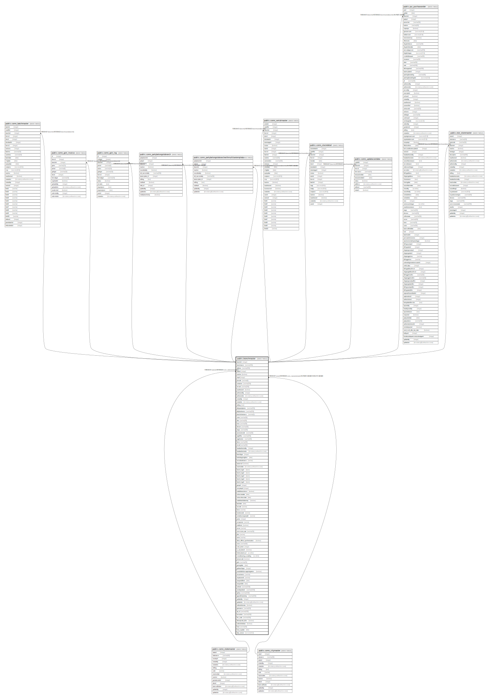

# public.branchmaster

## Description

## Columns

| Name | Type | Default | Nullable | Children | Parents | Comment |
| ---- | ---- | ------- | -------- | -------- | ------- | ------- |
| branchid | integer | nextval('branchmaster_branchid_seq'::regclass) | false | [public.comn_batchmaster](public.comn_batchmaster.md) [public.comn_gstr_invoice](public.comn_gstr_invoice.md) [public.comn_gstr_log](public.comn_gstr_log.md) [public.comn_partybelongstobranch](public.comn_partybelongstobranch.md) [public.comn_partybelongstobranchwithmultitaxtemplate](public.comn_partybelongstobranchwithmultitaxtemplate.md) [public.comn_serialmaster](public.comn_serialmaster.md) [public.comn_stockdetail](public.comn_stockdetail.md) [public.comn_updatecostdate](public.comn_updatecostdate.md) [public.pur_purchaseorder](public.pur_purchaseorder.md) [public.stor_storemaster](public.stor_storemaster.md) |  |  |
| branchname | varchar(100) |  | true |  |  |  |
| address | varchar(200) |  | true |  |  |  |
| stateid | integer |  | true |  | [public.comn_statemaster](public.comn_statemaster.md) |  |
| isactive | boolean | true | false |  |  |  |
| cityid | integer |  | true |  | [public.comn_citymaster](public.comn_citymaster.md) |  |
| pincode | varchar(6) |  | true |  |  |  |
| contactno | varchar(250) |  | true |  |  |  |
| remark | varchar(200) |  | true |  |  |  |
| isauthorized | boolean | false | false |  |  |  |
| authorizedby | integer |  | true |  |  |  |
| authorizedon | timestamp without time zone |  | true |  |  |  |
| createdby | integer |  | true |  |  |  |
| createdon | timestamp without time zone | now() | true |  |  |  |
| editlog | text |  | true |  |  |  |
| tallyipandportno | varchar(200) |  | true |  |  |  |
| tallybookname | varchar(200) |  | true |  |  |  |
| branchshortname | varchar(5) |  | true |  |  |  |
| cstno | varchar(30) |  | true |  |  |  |
| dtno | varchar(30) |  | true |  |  |  |
| tinno | varchar(30) |  | true |  |  |  |
| divison | varchar(30) |  | true |  |  |  |
| range | varchar(30) |  | true |  |  |  |
| assesseecode | varchar(30) |  | true |  |  |  |
| regdoffice | varchar(200) |  | true |  |  |  |
| regphoneno | varchar(30) |  | true |  |  |  |
| faxno | varchar(30) |  | true |  |  |  |
| email | varchar(50) |  | true |  |  |  |
| headauthorizedby | integer |  | true |  |  |  |
| headauthorizedon | timestamp without time zone |  | true |  |  |  |
| branchtype | integer |  | true |  |  |  |
| booksbeginingfrom | date | '2011-04-01'::date | false |  |  |  |
| excisebookname | varchar |  | true |  |  |  |
| autoemail | boolean | false | true |  |  |  |
| inactivedate | timestamp without time zone |  | true |  |  |  |
| branch_logo1 | bytea |  | true |  |  |  |
| branch_logo2 | bytea |  | true |  |  |  |
| branch_logo3 | bytea |  | true |  |  |  |
| branch_logo4 | bytea |  | true |  |  |  |
| branch_logo5 | bytea |  | true |  |  |  |
| groupid | integer |  | true |  |  |  |
| companyid | integer |  | true |  |  |  |
| enablefreescheme | boolean |  | true |  |  |  |
| schemetodate | date |  | true |  |  |  |
| schemefromdate | date |  | true |  |  |  |
| enablebackdateentry | boolean |  | true |  |  |  |
| backdate | date |  | true |  |  |  |
| ieccode | varchar |  | true |  |  |  |
| binno | varchar |  | true |  |  |  |
| locationcode | varchar |  | true |  |  |  |
| centralexciseposadd | varchar |  | true |  |  |  |
| portno | integer |  | true |  |  |  |
| smtpserver | varchar |  | true |  |  |  |
| enablessl | boolean |  | true |  |  |  |
| eccno | varchar |  | true |  |  |  |
| commision_rate | varchar(50) |  | true |  |  |  |
| pfno | varchar |  | true |  |  |  |
| esino | varchar |  | true |  |  |  |
| allow_offline_synchronization | boolean | true | true |  |  | if True then synchronize offline invoice otherwise it skip synchronization |
| cinno | varchar(50) |  | true |  |  |  |
| mail_server | integer |  | true |  |  |  |
| is_sub_branch | boolean | false | false |  |  | New field inserted because TMH branches are divided in two parts: Importer and Local |
| linked_branch_id | smallint |  | true |  |  |  |
| manufacturing_or_trading | smallint |  | true |  |  |  |
| bviewmode | boolean | false | true |  |  |  |
| gstin | varchar(25) |  | true |  |  |  |
| gstnregdate | date |  | true |  |  |  |
| gstbranchtype | integer |  | true |  |  |  |
| isavailableformrappintegration | boolean | false | true |  |  |  |
| nicusername | varchar |  | true |  |  |  |
| nicpassword | varchar |  | true |  |  |  |
| ewayvalidfrom | date |  | true |  |  |  |
| ewayvalidto | date |  | true |  |  |  |
| website | varchar(1024) |  | true |  |  |  |
| vendorportalurl | varchar(1024) |  | true |  |  |  |
| apikey | varchar(1024) |  | true |  |  |  |
| appnotificationkey | varchar(500) |  | true |  |  |  |
| updatedby | integer |  | true |  |  |  |
| updatedon | timestamp(6) without time zone | NULL::timestamp without time zone | true |  |  |  |
| isallowfortcstax | boolean | false | true |  |  |  |
| gstruname | varchar(50) |  | true |  |  |  |
| upi_id | varchar(100) | NULL::character varying | true |  |  |  |
| accountno | varchar(100) | NULL::character varying | true |  |  |  |
| ifsc_code | varchar(100) | NULL::character varying | true |  |  |  |
| allowqrcode_b2cs | boolean | false | true |  |  |  |
| isallowfortdstax | boolean | true | true |  |  |  |
| fssai | varchar(20) |  | true |  |  |  |
| fssai_expdate | date |  | true |  |  |  |
| tally_version | numeric(10,2) |  | true |  |  |  |

## Constraints

| Name | Type | Definition |
| ---- | ---- | ---------- |
| branchmaster_branchname_key | UNIQUE | UNIQUE (branchname) |
| branchmaster_pkey | PRIMARY KEY | PRIMARY KEY (branchid) |
| branchmaster_fk | FOREIGN KEY | FOREIGN KEY (cityid) REFERENCES comn_citymaster(cityid) ON UPDATE CASCADE ON DELETE CASCADE |
| branchmaster_stateid_fkey | FOREIGN KEY | FOREIGN KEY (stateid) REFERENCES comn_statemaster(stateid) |

## Indexes

| Name | Definition |
| ---- | ---------- |
| branchmaster_branchname_key | CREATE UNIQUE INDEX branchmaster_branchname_key ON public.branchmaster USING btree (branchname) |
| branchmaster_pkey | CREATE UNIQUE INDEX branchmaster_pkey ON public.branchmaster USING btree (branchid) |

## Triggers

| Name | Definition |
| ---- | ---------- |
| tgr_editlog | CREATE TRIGGER tgr_editlog AFTER UPDATE ON public.branchmaster FOR EACH ROW EXECUTE FUNCTION tgr_editlog() |

## Relations

---

> Generated by [tbls](https://github.com/k1LoW/tbls)
