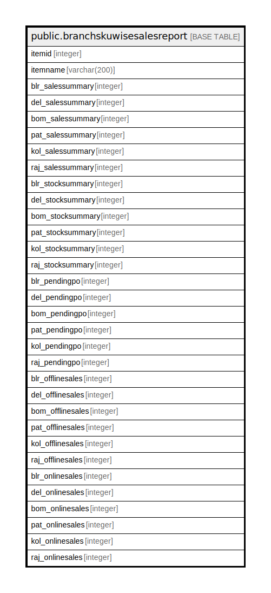

# public.branchskuwisesalesreport

## Description

## Columns

| Name | Type | Default | Nullable | Children | Parents | Comment |
| ---- | ---- | ------- | -------- | -------- | ------- | ------- |
| itemid | integer |  | true |  |  |  |
| itemname | varchar(200) |  | true |  |  |  |
| blr_salessummary | integer |  | true |  |  |  |
| del_salessummary | integer |  | true |  |  |  |
| bom_salessummary | integer |  | true |  |  |  |
| pat_salessummary | integer |  | true |  |  |  |
| kol_salessummary | integer |  | true |  |  |  |
| raj_salessummary | integer |  | true |  |  |  |
| blr_stocksummary | integer |  | true |  |  |  |
| del_stocksummary | integer |  | true |  |  |  |
| bom_stocksummary | integer |  | true |  |  |  |
| pat_stocksummary | integer |  | true |  |  |  |
| kol_stocksummary | integer |  | true |  |  |  |
| raj_stocksummary | integer |  | true |  |  |  |
| blr_pendingpo | integer |  | true |  |  |  |
| del_pendingpo | integer |  | true |  |  |  |
| bom_pendingpo | integer |  | true |  |  |  |
| pat_pendingpo | integer |  | true |  |  |  |
| kol_pendingpo | integer |  | true |  |  |  |
| raj_pendingpo | integer |  | true |  |  |  |
| blr_offlinesales | integer |  | true |  |  |  |
| del_offlinesales | integer |  | true |  |  |  |
| bom_offlinesales | integer |  | true |  |  |  |
| pat_offlinesales | integer |  | true |  |  |  |
| kol_offlinesales | integer |  | true |  |  |  |
| raj_offlinesales | integer |  | true |  |  |  |
| blr_onlinesales | integer |  | true |  |  |  |
| del_onlinesales | integer |  | true |  |  |  |
| bom_onlinesales | integer |  | true |  |  |  |
| pat_onlinesales | integer |  | true |  |  |  |
| kol_onlinesales | integer |  | true |  |  |  |
| raj_onlinesales | integer |  | true |  |  |  |

## Relations

---

> Generated by [tbls](https://github.com/k1LoW/tbls)
